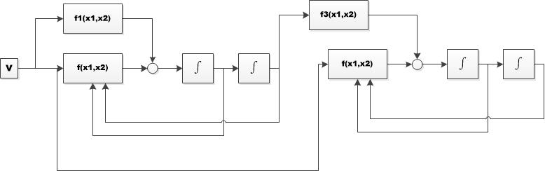

# 《基于复合微分跟踪器的电容式位置传感器》

《复合微分跟踪器在电容式位置传感器中的应用》

## **Abstract**

  针对从含有随机扰动的电容式位置传感器中提取位置信息，以及微分信号提取中，一般形式微分跟踪器不能很好兼顾信号跟踪相位滞后和噪声放大，通过对微分跟踪器进行等效线性分析，将复合形式微分跟踪器应用于位置信号跟踪以及速度估计，通过MATLAB\SIMULINK仿真以及实际测试。结果表明：复合微分跟踪器能光滑逼近原始位置信号，且能够有效提取微分信号，同一般形式微分跟踪器比较，能很好地兼顾相位滞后和噪声放大。

关键词：电容式位置传感器  复合微分跟踪器	位置跟踪	微分信号

  电容式位置传感器，应用电容极板效应，通过检测极板电容变化，实现位置的间接测量${^{[1]}}$。在激光切割行业中，相比较于其他类型位置传感器，电容式位置传感器具有以下几大优势${^{[2]}}$，结构简单、检测精度高、实时性强、非接触式等。因此被广泛应用于激光切割随动系统中，用于检测随动头与加工工件距离，作为控制系统第一位置环反馈单元，对于电容式位置传感器测量数据是激光随动控制系统性能的重要影响因素。本文针对从含噪声的电容式位置传感器中提取原始位置信息，以及速度估计进行研究，使用复合微分跟踪器技术${^{[3]}}$，通过MATLAB\SIMULIN软件仿真以及测试平台实测验证了微分跟踪器在原始位置信息提取，以及速度估计上的有效性。

## **引言**

  电容式位置传感器，一种基于电容极板效应间接测距装置，由于其具有的结构简单、检测精度高、灵敏度高、非接触式等优点${^{[1]}}$，广泛应用于激光随动控制系统中，用于实时测量随动头与加工工件距离，并且取得了良好的效果。在实际加工过程中，由于喷渣、极板接地不良、气体扰动、工件表面不平整、电容边缘效应等原因${^{[2]}}$，导致电容位置传感器直接获取的位置信息中存在较大的随机噪声，影响距离测量的精准度。由于激光切割对随动控制系统要求很高，在进行控制系统的设计过程中，还需要对位置微分信号进行有效提取，若采用直接微分（差分）方法进行微分信号提取会将噪声放大，不能有效提取出速度信号[4]，严重情况下导致控制回路抖动，机械异响等问题。微分跟踪器(Tracking Differentiator，TD)[5]最早是由韩京清提出，通过对其频域分析[6]，表明其在含有随机噪声、不连续原始信号逼近、微分信号提取具有很好的性能，此外同使用较多的kalman滤波器相比，计算复杂度更小。典型微分跟踪器，存在原始信号跟踪相位滞后和噪声放大之间不能很好兼顾的问题，本文在等效线性微分跟踪器分析的基础上[10]，将复合微分跟踪器应用于电容式位置传感器中，通过仿真以及实际测试验证结果表明，相对于一般形式的微分跟踪器，复合微分跟踪器在相位滞后、微分信号提取方面具有更好的效果。

## **1.电容式位置传感器原理分析**

​    实验平台所采用的传感器类型为变间隙式平行板电容放大器，电容极板分别为感应极板（活动极板）以及加工工件（固定极板）。感应极板为激光切割系统中普遍使用的圆形极板。加工过程中，将电容极板端安装于切割头，随着浮动头一起运动，以实现切割头相对于加工工件位置的实时测量。变间隙式平行板感应极板端截面如果1-1所示。

**测距原理**
$$
\begin{align}
& C = \frac{\epsilon_0*\epsilon_1*S}{d}\\
& 其中,C：极板电容\\
&\epsilon_1,\epsilon_0：真空介电常数、相对介电常数\\
&S：极板面积\\
& C + \Delta C  = \frac{\epsilon_0S}{d_1 - \Delta d_1 + d_2/\epsilon_2}\\
\end{align}
$$
  从上式可以看出，电容传感器位置和电容之间的关系受介电系数影响大，且非线性和灵敏度之间存在矛盾，因此实验中，采用离线查表的方式实现位置检测，其具体过程包括电容-位置高度表生成，根据实现电容查表获取对应高度，相对于在线计算方法，此方法运算量小，计算导致的精度损失更小，在外界扰动较小的情况下精度高。

## **2.复合微分跟踪器**

### 2.1 经典微分跟踪器

  跟踪微分器（TD）${^{[7]}}$，是由韩京清提出来的一种从不连续或者带有随机噪声的信号中提取连续信号以及微分信号的技术${^{[8]}}$；控制系统的设计过程中，由于量测单元精度、系统内外部存在干扰等局限性，测量到的数据同系统真实情况存在一定偏差，此外，原始信号的微分信号通常无法通过测量的方式直接获取。因此如何获取高质量的原始信号逼近，及微分信号对于控制品质的提高有着重要的意义。 微分跟踪器不仅能含有噪声的测量信号中获取良好的原始信号的逼近，还具有较好的滤波特性，此外还兼具高阶信号的估计作用。本文研究限于二阶微分跟踪器在原始信号滤波，及微分信号提取中的使用；

 

经典微分跟踪器的基本原理如下：

如下二阶系统（1）：
$$
\begin{align}

&\begin{cases}
&\dot x_1(t) = x_2(t)\\
&\dot x_2(t) = f(x_1(t),x_2(t))
&\end{cases}

\end{align}
$$
其中${x_1,x_2}$是系统的状态变量，${f({.})}$是系统的作用函数。

有如下定理1${^{}}$：

对上述二阶系统，按菲利波夫意义所有解${x_1(t),x_2(t)}$有界且满足如下条件：
$$
\begin{align}
\lim_{t\to ∞}x_1(t) = 0; \lim_{t \to ∞}x_2(t) = 0;
\end{align}
$$
则对于任意有界可积信号$v(t),t\in [0,+\infty]及任意常数T>0$,系统（2）将满足${\lim_{0 \to \infty}(\int_0^{T}|x_1(t) - v(t)|)dt = 0 ,\lim_{t\to+\infty}x_2(t) = 0}$。

系统（2）：
$$
\begin{align}

&\begin{cases}
&\dot x_1(t) = x_2(t)\\
&\dot x_2(t) = R^2.f(x_1(t),x_2(t),\frac{x_2(t)}{R})
&\end{cases}

\end{align}
$$
结论表明，构造适当的作用函数${f({.})}$，使得系统(1)渐进稳定，${x_1(t)}$将平均收敛于${v(t)}$,${x_2(t)}$收敛于${x_1(t)}$的广义导数，系统（2）称为跟踪微分器${^{[?]}}$。

### 2.2 复合微分跟踪器

 在对微分跟踪器的研究中，${f(.)}$跟踪函数对微分跟踪器的滤波特性、跟踪结果相位滞后、微分信号起着决定性作用。现有文献中，跟踪函数${f(.)}$被作为重点研究对象，在解决相位滞后，微分信号提取方面许多学者提出了不同形式跟踪函数。文献${[13]}$中提出的非线性幂次项形式跟踪函数，在平衡点附近为线性，远离平衡点为非线性，证明了微分跟踪器在原始信号逼近，微分信号提取相对于传统小时差近似微分的优异性。文献${[15]}$在典型微分跟踪器的基础上，提出改进型微分跟踪器，快速性和准确性的要求，可实现任意信号的跟踪和微分。文献${[16]}$提出一种基于奇异摄动技术的有限时间收敛微分器。文献${[17]}$，针对离散跟踪微分器 ( Han-TD) 加速度函数结构复杂、参数整定繁琐的不足，提出了双曲正切函数改进微分器。文献${[ 18 ]}$针对离散跟踪微分 器和快速型跟踪微分器的研究，提出改进分线性跟踪微分器。文献${[19]}$分析非线性滑模跟踪微分器的基础上,提出一种结构简单、易于实现的非线性微分器。此外还有双曲正弦，基于sigmoid函数等不同形式的微分跟踪器；

  针对不同由不同形式跟踪函数的微分跟踪器在分析以及参数调试等方面存在的难点，浙江大学的劳等人对跟踪微分器在平衡点和远离平衡点附近进行了系统性分析，并在得出结论，微分跟踪器性能主要由平衡点附近动态特性决定。在忽略高阶项的前提下，并给出了不同形式跟踪函数的统一形式。
$$
\begin{align}
&\begin{cases}
&\dot x_1(t) = x_2(t)\\
&\dot x_2(t) = -\alpha_1|x_1(t)|^{\beta_1}sgn(x_1(t)) -&\alpha_2|x_2(t)|^{\beta_2}sgn(x_2(t)) 
&\end{cases}
\end{align}
$$
  ${\alpha_1,\alpha_2,\beta_1,\beta_2}$的参数在设计过程中，需要保证系统（1）的收敛性。通过在平衡点附近线性化之后，可以进一步将不同形式的跟踪函数写成如下形式，
$$
\begin{align}
\begin{cases}
&\dot x_1(t) = x_2(t)\\
&\dot x_2(t) = -R^2[-k_1(x_1(t)-v(t)) - k_2\frac{x_2(t)}{R}]\\
\end{cases}
\end{align}
$$
简化了微分跟踪器的设计过程，并从频域角度给出了理论分析证明。并针对微分跟踪器由于二阶串联积分系统导致的跟踪相位滞后以及降低噪声的影响提出了复合微分跟踪器，本文在此基础上，将复合微分跟踪器应用于电容位置传感器上，提取位置以及速度信号。仿真和实践证明了复合微分跟踪器的有效性；

  复合微分跟踪器系统框图：

  复合微分跟踪器原理：
$$
\begin{align}
&\begin{cases}
\dot x_1(t)= x_2(t)\\
\dot x_2(t) = R_1^2[-k_1(x_1(t)-v(t))-k_2\frac{x_2(t)}{R}] + \alpha _1\dot v(t)\\
\dot x_3(t)= x_4(t)\\
\dot x_4(t) = R_2^2[-k_3(x_3(t)-v(t))-k_4\frac{x_4(t)}{R_2}] + \alpha _2\dot x_1(t)\\
\end{cases}
\end{align}
$$
  两个跟踪微分器的串联形式，微分跟踪器（i）主要的作用是为微分跟踪器（ii）提供光滑的跟踪信号，作为前馈补偿，微分跟踪器在复合跟踪微分器中其主导作用，在设计的过程中，应根据原始信号的特性调整相应的参数。满足滤波和微分信号的提取要求。

 

## 3.仿真及实验结果分析

  为了验证复合微分跟踪器在原始信号逼近，以及微分信号提取的有效性，分别对上述微分跟踪器在MATLAB/SIMULINK平台上进行仿真，并在测试平台上进行实际测试，从仿真和实验平台上的结果看，复合微分跟踪器在电容式位置传感器中，提取原始位置信号以及速度信号估计中优异性能，复合微分跟踪器是由两个等效线性形式微分跟踪器组成，两个微分跟踪器的作用不一致，决定了其在参数上的差异，通过效线性微分器分析，降低系统的等效阻尼比，可以减小系统的跟踪误差，另一方面，阻尼比过小会导致振荡放大噪声的影响。跟踪器（i）的作用是获取原始的光滑逼近，并将此信号作为跟踪器（ii）的前馈补偿量，因此微分跟踪器（i）的主要作用是对原始信号进行滤波；复合微分跟踪器相比较于原有的典型的微分跟踪器，由于引进了前馈补偿的思想，兼顾滤波品质和相位滞后，能获得更好的微分以及跟踪信号。

**严谨**

**严谨**

**严谨**

  

## 4.结语

  主要讨论了微分跟踪器的等效线性形式，以及复合微分跟踪器原理，并将复合微分跟踪器使用在电容式位置传感器中，通过MATLAB/SIMULINK仿真以及实际测试，实验及仿真结果表明，在电容式位置传感器中，从带噪声的位置信号中获取原始位置信号光滑逼近，以及速度信号的估计方面的具有良好的性能，为精准控制提供了先决条件，对控制系统设计具有重要意义。

## Reference

[1]王海，电容式激光切割头高度跟随控制系统的研究与实现，[硕士论文]，华中科技大学，2016

[2]缪震华.激光切割机电容式Z浮的研究[D].湖北:华中科技大学,2005.

[3]武利强,林浩,韩京清.跟踪微分器滤波性能研究[J].系统仿真学报,2004,16(4):651-652,670.

[4] 《一种新型的非线性跟踪一微分器的设计及其稳定性分析》

[5] 韩京清，王伟，非线性跟踪微分器，1994

[6] 韩京清，黄远灿，二阶跟踪—微分器的频率特性，数学的实践与认识，2003（03），71-74

[7] 《跟踪微分器》韩京清，王伟

[8] 《TD滤波器及其应用》韩京清，武力强

[9] 《自抗扰控制技术》 P61

[10] 《微分跟踪器的等效线性分析及优化》

[11] 《跟踪-微分器的离散形式》韩京清 袁露林

[12]  自抗扰控制技术-估计补偿不确定因素的控制技术 p60-62

[13] 《非线性微分—跟踪器》韩京清，王伟

[14] 《A Tracking differentiator based on Taylor expansion》

[15] 史永丽, 侯朝桢. 改进的非线性跟踪微分器设计[J]. 控制与决策, 2008(06):49-52+61. 

[16] 《Finite-Time-Convergent Differentiator Based on Singular Perturbation Technique》

[17]《改进分线性跟踪微分器》

[18]《双曲正切跟踪微分器设计及相平面分析》

[19]《改进的跟踪微分器设计》

[?] 平均收敛，广义导数

[**纲要**](<https://mm.edrawsoft.cn/map.html?obj=qqDECC8DABBFB246A3DCB61DA911808C52/Personal/%E5%A4%8D%E5%90%88%E5%BE%AE%E5%88%86%E8%B7%9F%E8%B8%AA%E5%99%A8%E7%BA%B2%E8%A6%81.emmx>)