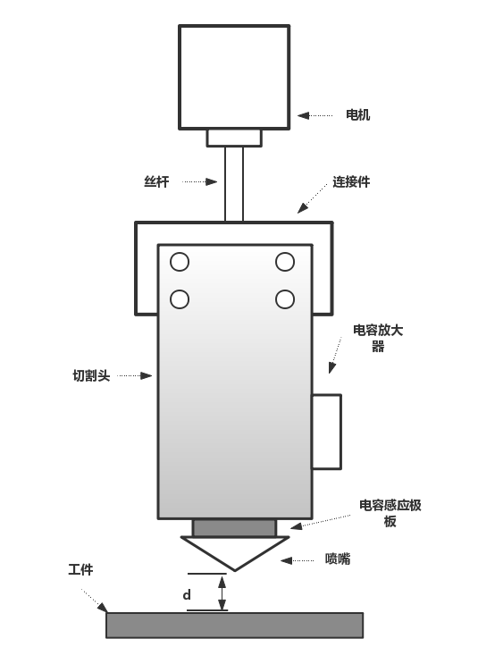
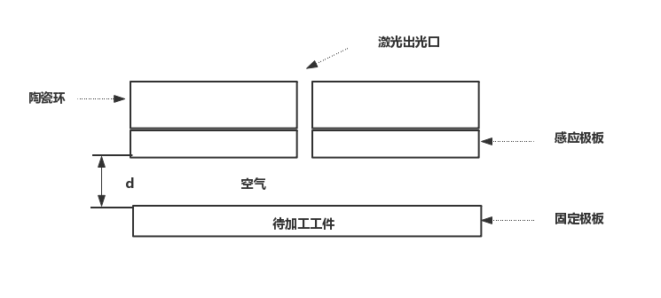
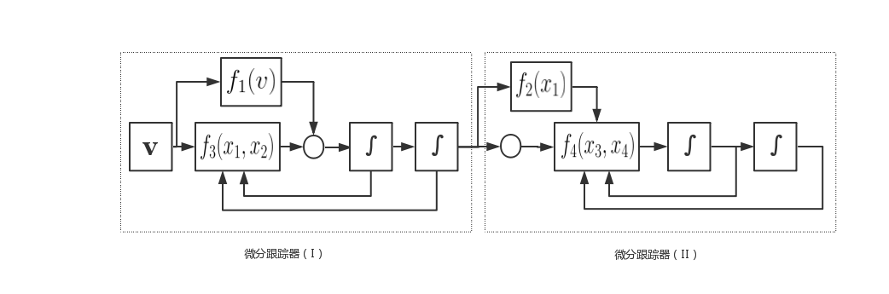
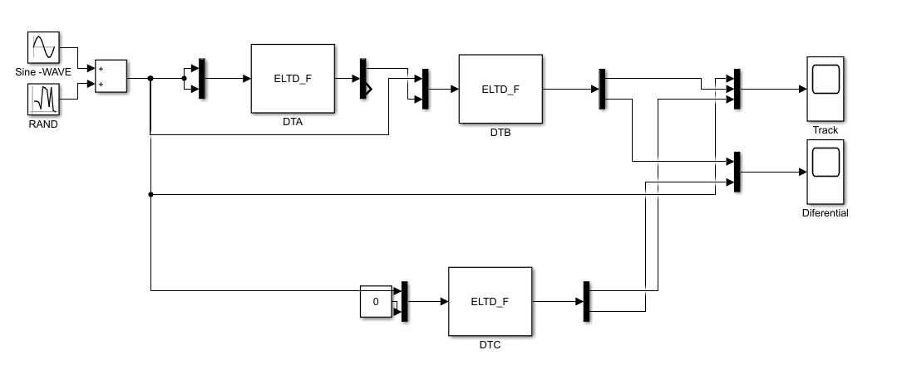
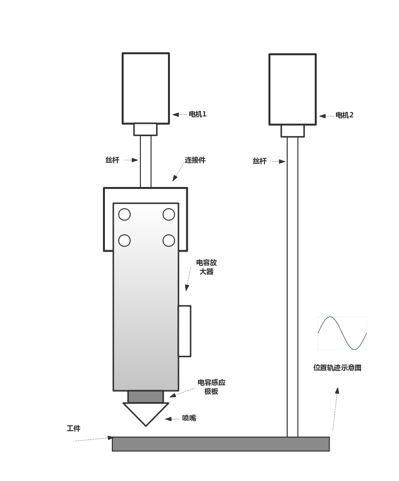
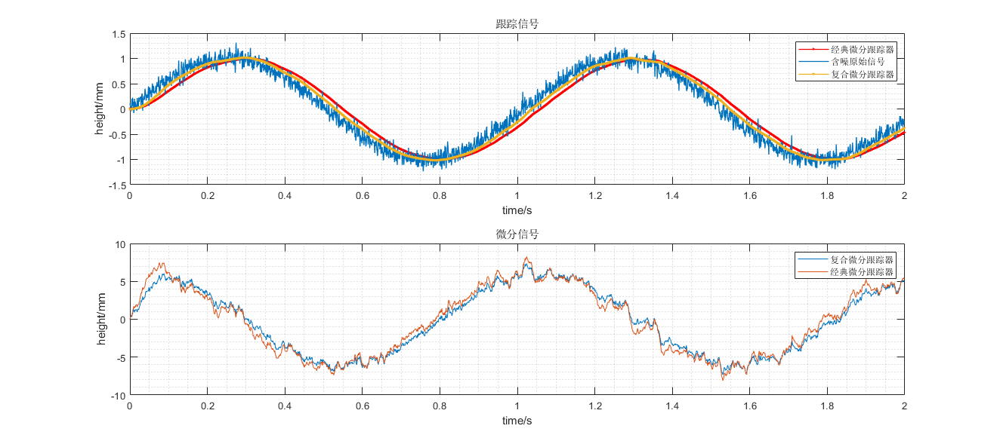

# 复合跟踪微分器在电容式位置传感器中的应用

《复合跟踪微分器在电容式位置传感器中的应用》

吴昊1 XX2 XX3

(1. 上海交通大学，自动化系，上海  200240；2. 单位名称 城市 邮编)

**摘要:** 针对在从含有随机扰动的电容式位置传感器中获取位置信息以及速度信号的问题中。典型跟踪微分器存在不能很好兼顾信号跟踪相位滞后和噪声放大，参数多，调试复杂等问题。在跟踪微分器等效线性分析基础上，提出了复合形式跟踪微分器，用于式电容传感器位置信号跟踪以及速度信号估计，通过MATLAB\SIMULINK仿真以及实验平台测试，结果表明：复合跟踪微分器能光滑逼近原始位置信号，且能够有效提取速度信号，相比较于典型跟踪微分器，能更好地兼顾跟踪信号相位滞后以及速度信号噪声。

关键词：位置传感器；复合跟踪微分器；位置跟踪；速度估计

# Capacitive position sensor based on composite differential tracker

Wu Hao，XX，XX

(1.Department of Automation, Shanghai Jiao Tong University, Shanghai 200240，P.R.China;

2.Shanghai Weihong Electronic Technology Co.,Ltd.,Shanghai 200240，P.R.China)

**Abstract**:Aiming at obtaining position information and velocity signals from a capacitive position sensor containing random disturbances, the general form of differential tracker cannot well take into account the problems of signal tracking phase lag and noise amplification, many parameters and complicated debugging.Based on the equivalent linear analysis of the differential  tracker, a composite form of differential tracker was applied to position signal tracking and velocity signal estimation of the position capacitive sensor. The simulations and experimental platform tests of MATLAB \ SIMULINK showed that the composite differential tracker can approach the original smoothly. The position signal and the speed signal can be effectively extracted. Compared with the general form differential tracker, the tracking signal phase lag and the speed signal noise can be better taken into account.

Key words: position sensor；compound differential tracker；position tracking；velocity estimation

${^{[23]}}$

## **引言**

  电容式位置传感器，是一种基于电容极板效应的间接测距装置，由于其具有结构简单、检测精度高、灵敏度高、非接触式等优点${^{[1]}}$，广泛应用于激光随动控制系统中，用于实时测量随动头与加工工件距离，并且取得了良好的效果。在实际加工过程中，由于喷渣、极板接地不良、气体扰动、工件表面不平整、电容边缘效应等原因，导致电容位置传感器直接获取的位置信息中存在较大的随机噪声，影响距离测量的精准度。为了获得良好的控制品质，在进行控制系统的设计过程中，还需要对位置微分信号进行有效提取${^{[23][27]}}$，若采用直接微分（差分）方法进行微分信号提取，由于噪声扰动不能有效提取出速度信号${^{[3]}}$，严重情况下导致控制回路震颤，机械异响等问题。

  跟踪微分器(Tracking Differentiator，TD)${^{[2]}}$，最早是由韩京清提出，通过对其频域分析，收敛性分析${^{[29]}}$，表明其在含有随机噪声、不连续原始信号逼近、微分信号提取具有很好的性能${^{[3,4]}}$，同使用较多的Kalman滤波器${^{^{}[24]}}$相比，计算复杂度更小。经典跟踪微分器，存在原始信号跟踪相位滞后和噪声放大之间不能很好兼顾的问题，本文在等效线性跟踪微分器分析的基础上${^{[19]}}$，将复合跟踪微分器应用于电容式位置传感器中，通过仿真以及实际测试验证结果表明，相比较于经典跟踪微分器，复合跟踪微分器在相位滞后、微分信号提取方面具有更好的效果。

## **1.电容式位置传感器原理分析**

  实验平台所采用的传感器类型为变间隙式平行板电容位置传感器，电容极板由感应极板和固定极板两部分构成，感应极板安装于位置式电容传感器下端，待加工工件则作为固定极板。感应极板为激光切割系统中普遍使用的圆形极板。加工过程中，将电容极板端安装于切割头，随着浮动头一起运动，电容位置传感器通过检测固定极板和感应极板间电容信号，并通过电容放大电路，实现切割头相对于加工工件位置的实时测量。使用电容式位置传感器激光切割头示意图如图1-1所示，变间隙式平行板感应极板端截面如图1-2所示。

​							  图1-1 切割头示意

​										图1-2 电容极板截面图

**测距原理**
$$
\begin{align}
& C：极板电容，S：极板面积，d：极板间距\\
&\epsilon_1,\epsilon_0：真空介电常数、相对介电常数\\
&C = \frac{\epsilon_0*\epsilon_1*S}{d}\\
& 由于极板之间为空气，一般情况下\epsilon_1 = 1\\
& 上式可表述为：C = \frac{\epsilon_0S}{d}\\
& 极板间距变化量\Delta d与电容变化量\Delta C对应关系：\\
&  C + \Delta C  = \frac{\epsilon_0S}{d + \Delta d}\\
&
\end{align}
$$
  从上式可以看出，电容传感器位置和电容之间的关系受介电系数影响大，且非线性和灵敏度之间存在矛盾，因此实验中，采用离线查表的方式实现位置检测，其具体过程包括电容-位置高度表生成，根据实现电容查表获取对应高度，相对于在线计算方法，此方法运算量小，计算导致的精度损失更小，在外界扰动较小的情况下精度高。

## **2.复合跟踪微分器**

### 2.1 经典跟踪微分器

  跟踪微分器（TD），是由韩京清提出来的一种从不连续或者带有随机噪声的信号中提取连续信号以及微分信号的技术${^{[2]}}$。控制系统的设计过程中，由于量测单元精度、系统内外部存在干扰等局限性，测量到的数据同系统真实情况存在一定偏差，此外，原始信号的微分信号通常无法通过测量的方式直接获取。因此如何获取高质量的原始信号逼近，及微分信号对于控制品质的提高有着重要的意义${^{[23,27]}}$。 跟踪微分器具有较好的滤波特性,不仅能含有噪声的测量信号中获取良好的原始信号的逼近，此外还兼具高阶信号的估计作用${^{[15]}}$。本文研究限于二阶跟踪微分器在原始信号滤波，及微分信号提取中的使用。 

经典跟踪微分器的基本原理如下：

如下二阶系统（1）：
$$
\begin{align}

&\begin{cases}
&\dot x_1(t) = x_2(t)\\
&\dot x_2(t) = f(x_1(t),x_2(t))
&\end{cases}

\end{align}
$$
其中${x_1,x_2}$是系统的状态变量，${f({.})}$是系统的作用函数。

有如下定理1${^{[5]}}$：

对上述二阶系统，按菲利波夫意义所有解${x_1(t),x_2(t)}$有界且满足如下条件：
$$
\begin{align}
\lim_{t\to ∞}x_1(t) = 0; \lim_{t \to ∞}x_2(t) = 0;
\end{align}
$$
则对于任意有界可积信号$v(t),t\in [0,+\infty]及任意常数T>0$,系统（2）将满足${\lim_{0 \to \infty}(\int_0^{T}|x_1(t) - v(t)|)dt = 0 ,\lim_{t\to+\infty}x_2(t) = 0}$。

系统（2）：
$$
\begin{align}

&\begin{cases}
&\dot x_1(t) = x_2(t)\\
&\dot x_2(t) = R^2.f(x_1(t),x_2(t),\frac{x_2(t)}{R})
&\end{cases}

\end{align}
$$
结论表明，构造适当的作用函数${f({.})}$，使得系统(1)渐进稳定，${x_1(t)}$将平均收敛于${v(t)}$,${x_2(t)}$收敛于${x_1(t)}$的广义导数，系统（2）称为跟踪微分器${^{[9]}}$。

### 2.2 复合跟踪微分器

  在对跟踪微分器的研究中，${f(.)}$跟踪函数对跟踪微分器的滤波特性、跟踪结果相位滞后、微分信号起着决定性作用。现有文献中，跟踪函数${f(.)}$被作为重点研究对象，在解决相位滞后，微分信号提取方面许多学者提出了不同形式跟踪函数。文献${[11]}$中提出的非线性幂次项形式跟踪函数，在平衡点附近为线性，远离平衡点为非线性，证明了跟踪微分器在原始信号逼近，微分信号提取相对于传统小时差近似微分的优异性。文献${[12]}$在典型跟踪微分器的基础上，提出改进型跟踪微分器，快速性和准确性的要求，可实现任意信号的跟踪和微分。文献${[13]}$提出一种基于奇异摄动技术的有限时间收敛微分器。文献${[14]}$，针对典型针对离散跟踪微分器稳定性差和输出振颤明显的问题,设计了一种改进的高 稳定性快速收敛非线性-线性跟踪微分器。文献${[15]}$在分析非线性滑模跟踪微分器的基础上,提出一种结构简单、易于实现的非线性微分器。此外还有基于反双曲正弦函数${^{[16]}}$，双曲正切函数${^{[17][20]}}$，改进sigmoid函数${^{[18]}}$，改进反正切${^{[26]}}$等不同形式的跟踪微分器；

  针对不同由不同形式跟踪函数的跟踪微分器在分析以及参数调试等方面存在的难点，浙江大学的劳等人对跟踪微分器在平衡点和远离平衡点附近进行了系统性分析，并在得出结论，跟踪微分器性能主要由平衡点附近动态特性决定。在忽略高阶项的前提下，并给出了不同形式跟踪函数的统一形式${^{[19][21]}}$。
$$
\begin{align}
&\begin{cases}
&\dot x_1(t) = x_2(t)\\
&\dot x_2(t) = -\alpha_1|x_1(t)|^{\beta_1}sgn(x_1(t)) -&\alpha_2|x_2(t)|^{\beta_2}sgn(x_2(t)) 
&\end{cases}
\end{align}
$$
  ${\alpha_1,\alpha_2,\beta_1,\beta_2}$的参数在设计过程中，需要保证系统（1）的收敛性。通过在平衡点附近线性化之后，可以进一步将不同形式的跟踪函数写成如下形式，
$$
\begin{align}
\begin{cases}
&\dot x_1(t) = x_2(t)\\
&\dot x_2(t) = -R^2[-k_1(x_1(t)-v(t)) - k_2\frac{x_2(t)}{R}]\\
\end{cases}
\end{align}
$$
简化了跟踪微分器的设计过程，并从频域角度给出了理论分析证明。并针对跟踪微分器由于二阶串联积分系统导致的跟踪相位滞后以及降低噪声的影响提出了复合跟踪微分器，本文在此基础上，将复合跟踪微分器应用于电容位置传感器上，提取位置以及速度信号。仿真和实践证明了复合跟踪微分器的有效性；

  复合跟踪微分器系统框图：

​								图2-1 复合跟踪微分器系统框图

  复合跟踪微分器原理：
$$
\begin{align}
&\begin{cases}
\dot x_1(t)= x_2(t)\\
\dot x_2(t) = R_1^2[-k_1(x_1(t)-v(t))-k_2\frac{x_2(t)}{R}] + \alpha _1\dot v(t)\\
\dot x_3(t)= x_4(t)\\
\dot x_4(t) = R_2^2[-k_3(x_3(t)-v(t))-k_4\frac{x_4(t)}{R_2}] + \alpha _2\dot x_1(t)\\
\end{cases}
\end{align}
$$
  文献[25]中使用的直接前馈补偿方式，不能很好地兼顾相位滞后和滤波性能，因此采用两个跟踪微分器的串联形式组成复合跟踪微分器，跟踪微分器（i）主要的作用是为跟踪微分器（ii）提供光滑的跟踪信号，作为前馈补偿，跟踪微分器（ii）在复合跟踪微分器中起主导作用，在设计的过程中，应根据原始信号的特性调整相应的参数。满足滤波和微分信号的提取要求。

 

## 3.仿真及实验结果分析

  为了验证复合跟踪微分器在原始信号逼近，以及微分信号提取的有效性，搭建Simulink仿真模型，仿真模型框图如图3-1所示，复合跟踪微分器使用两个跟踪微分器TDA、TDB串联构成，跟踪微分器（TDC）作为对比，前馈补偿输入量为0，跟踪微分器输入带高斯白噪声（均值：0，方差0.04）频率1HZ，幅值1的正弦信号。实验平台通过控制工件进行正弦（频率1Hz，幅值1mm）运动，模拟实际加工过程，实验平台如图3-2所示。

​																				图3-1 Simulink仿真框图

​																				图3-2 实验示意图

  复合跟踪微分器是由两个等效线性形式跟踪微分器组成，两个跟踪微分器的作用不一致，决定了其在参数上的差异，通过效线性微分器分析，降低系统的等效阻尼比，可以减小系统的跟踪误差，另一方面，阻尼比过小会导致振荡放大噪声的影响。跟踪器（i）的作用是获取原始的光滑逼近，并将此信号作为跟踪器（ii）的前馈补偿量，因此跟踪微分器（i）的主要作用是对原始信号进行滤波。复合跟踪微分器相比较于经典跟踪微分器，由于引进了前馈补偿的思想，兼顾滤波品质和相位滞后，能获得更好的微分以及跟踪信号。 分别对上述跟踪微分器在MATLAB/SIMULINK平台上进行仿真，并在测试平台上进行实际测试，从仿真和实验平台上的结果看，复合跟踪微分器在电容式位置传感器中，提取原始位置信号以及速度信号估计中优异性能，图3-3，3-4分别为仿真和实测结果。

 

​																				图3-3  仿真结果

  							  												图3-4 实验平台测试

## 4.结语

  主要讨论了跟踪微分器的等效线性形式，以及复合跟踪微分器原理，并将复合跟踪微分器使用在电容式位置传感器中，通过MATLAB/SIMULINK仿真以及实际测试，实验及仿真结果表明，在电容式位置传感器中，从带噪声的位置信号中获取原始位置信号光滑逼近，以及速度信号的估计方面的具有良好的性能，为精准控制提供了先决条件，对控制系统设计具有重要意义。将其应用于激光随动控制系统中，作为自抗扰控制器的主要部分。

## Reference

[1]王海.电容式激光切割头高度跟随控制系统的研究与实现[D].湖北:华中科技大学,2016.

[2]武利强,林浩,韩京清.跟踪微分器滤波性能研究[J].系统仿真学报,2004,16(4):651-652,670.

[5]韩京清, 王伟. 非线性跟踪─微分器[J]. 系统科学与数学, 1994(02):177-183.

[6]韩京清, 黄远灿. 二阶跟踪—微分器的频率特性[J]. 数学的实践与认识, 2003(03):72-75.

[7]武利强, 韩京清. TD滤波器及其应用[J]. 计算技术与自动化, 2004, 22(z1):61-63.

[8]韩京清.自抗扰控制技术:估计补偿不确定因素的控 制技术[ M] .北京:国防工业出版社, 2008:61

[9]Zhao B , Li Y . Decentralized differential tracker based control of reconfigurable manipulators without velocity sensor[C]// 2014 33rd Chinese Control Conference (CCC). IEEE, 2014.

[10]韩京清, 袁露林. 跟踪—微分器的离散形式[J]. 系统科学与数学, 1999, 19(3):268-273.

[11]王新华，陈增强，袁著祉，全程快速非线性跟踪-微分器，控制理论与应用，2003（06），875-878

[12]史永丽, 侯朝桢. 改进的非线性跟踪微分器设计[J]. 控制与决策, 2008(06):49-52+61. 

[13]Wang X , Chen Z , Yang G . Finite-Time-Convergent Differentiator Based on Singular Perturbation Technique[J]. IEEE TRANSACTIONS ON AUTOMATIC CONTROL AC, 2007.

[14]赵鹏，姚敏立，陆长捷等，高稳快速非线性-线性跟踪微分器设计，西安交通大学学报，2011，45（08），43-48

[15]葛连正, 陈健, 李瑞峰. 改进的跟踪微分器设计[J]. 吉林大学学报(工学版), v.41;No.157(05):1439-1443.

[16]周涛，基于反双曲正弦函数的跟踪微分器，控制与决策，2014，29（06），1139-1142

[17]毛海杰，李炜，冯小林，基于双曲正切的非线性跟踪微分器设计，计算机应用，2016，36（z1），305-309

[18]邵星灵，王宏伦，基于改进sigmoid函数的非线性跟踪微分器，控制理论与应用，2014，31（8），1116-1122

[19]Feng H , Li S . A tracking differentiator based on Taylor expansion[J]. Applied Mathematics Letters, 2013, 26(7):735-740.

[20]刘延泉, 郭佳颖. 双曲正切跟踪微分器设计及相平面分析[J]. 电力科学与工程, 2017(10):78-82.

[21]劳立明, 陈英龙, 赵玉刚, et al. 跟踪微分器的等效线性分析及优化[J]. 浙江大学学报(工学版), 2018, v.52;No.334(02):23-31.

[22]张帆, 徐华中, 罗杰, et al. 一种具有动态边界特征的二阶离散跟踪微分器[J]. 信息与控制, 2018, 47(05):65-74+80.

[23]Bu X W , Wu X Y , Chen Y X , et al. Design of a class of new nonlinear disturbance observers based on tracking differentiators for uncertain dynamic systems[J]. International Journal of Control, Automation and Systems, 2015, 13(3):595-602.

[24]Dulgar O , Gezer R B , Kutay A T . Extended Kalman Filter Based Robust Altitude Controller for Sea Skimming Missiles[C]// AIAA Guidance, Navigation, and Control Conference. 2016.

[25]Tian D P , Shen H H , Dai M . Improving the Rapidity of Nonlinear Tracking Differentiator via Feedforward[J]. IEEE Transactions on Industrial Electronics, 2014, 61(7):3736-3743.

[26]卜祥伟, 吴晓燕, 马震, et al. 改进的反正切跟踪微分器设计[J]. 上海交通大学学报, 2015(02):26-30.

[27]Chunqiang LIU,Guangzhao LUO,Zhe CHENetc., A linear ADRC-based robust high-dynamic double-loop servo system for aircraft electro-mechanical actuators, Chinese Journal of Aeronautics, 2019, 32（9）, 2174-2187

---

[1]王海.电容式激光切割头高度跟随控制系统的研究与实现[D].湖北:华中科技大学,2016.

[2]韩京清, 王伟. 非线性跟踪─微分器[J]. 系统科学与数学, 1994(02):177-183.

[3]武利强,林浩,韩京清.跟踪微分器滤波性能研究[J].系统仿真学报,2004,16(4):651-652,670.

[4]韩京清, 黄远灿. 二阶跟踪—微分器的频率特性[J]. 数学的实践与认识, 2003(03):72-75.

[5]韩京清.自抗扰控制技术:估计补偿不确定因素的控 制技术[ M] .北京:国防工业出版社, 2008:61

[10]韩京清, 袁露林. 跟踪—微分器的离散形式[J]. 系统科学与数学, 1999, 19(3):268-273.

[11]王新华，陈增强，袁著祉，全程快速非线性跟踪-微分器，控制理论与应用，2003（06），875-878

[12]史永丽, 侯朝桢. 改进的非线性跟踪微分器设计[J]. 控制与决策, 2008(06):49-52+61. 

[14]赵鹏，姚敏立，陆长捷等，高稳快速非线性-线性跟踪微分器设计，西安交通大学学报，2011，45（08），43-48

[15]葛连正, 陈健, 李瑞峰. 改进的跟踪微分器设计[J]. 吉林大学学报(工学版), v.41;No.157(05):1439-1443.

[16]周涛，基于反双曲正弦函数的跟踪微分器，控制与决策，2014，29（06），1139-1142

[17]毛海杰，李炜，冯小林，基于双曲正切的非线性跟踪微分器设计，计算机应用，2016，36（z1），305-309

[18]邵星灵，王宏伦，基于改进sigmoid函数的非线性跟踪微分器，控制理论与应用，2014，31（8），1116-1122

[19]Feng H , Li S . A tracking differentiator based on Taylor expansion[J]. Applied Mathematics Letters, 2013, 26(7):735-740.

[20]刘延泉, 郭佳颖. 双曲正切跟踪微分器设计及相平面分析[J]. 电力科学与工程, 2017(10):78-82.

[21]劳立明, 陈英龙, 赵玉刚, et al. 跟踪微分器的等效线性分析及优化[J]. 浙江大学学报(工学版), 2018, v.52;No.334(02):23-31.

[22]张帆, 徐华中, 罗杰, et al. 一种具有动态边界特征的二阶离散跟踪微分器[J]. 信息与控制, 2018, 47(05):65-74+80.

[23]Bu X W , Wu X Y , Chen Y X , et al. Design of a class of new nonlinear disturbance observers based on tracking differentiators for uncertain dynamic systems[J]. International Journal of Control, Automation and Systems, 2015, 13(3):595-602.

[24]Dulgar O , Gezer R B , Kutay A T . Extended Kalman Filter Based Robust Altitude Controller for Sea Skimming Missiles[C]// AIAA Guidance, Navigation, and Control Conference. 2016.

[25]Tian D P , Shen H H , Dai M . Improving the Rapidity of Nonlinear Tracking Differentiator via Feedforward[J]. IEEE Transactions on Industrial Electronics, 2014, 61(7):3736-3743.

[26]卜祥伟, 吴晓燕, 马震, et al. 改进的反正切跟踪微分器设计[J]. 上海交通大学学报, 2015(02):26-30.

[27]Chunqiang LIU,Guangzhao LUO,Zhe CHENetc., A linear ADRC-based robust high-dynamic double-loop servo system for aircraft electro-mechanical actuators, Chinese Journal of Aeronautics, 2019, 32（9）, 2174-2187

[28]Dong C H , Lian X , Wu X H . Research on linear tracking-differentiator to track interference signal[J]. Fangzhi Gaoxiao Jichukexue Xuebao, 2014, 27(4):439-442 and 458.

[29] Guo B Z , Zhao Z L . On convergence of tracking differentiator and application to frequency estimation of sinusoidal signals[C]// Control Conference. IEEE, 2011.

[9]Zhao B , Li Y . Decentralized differential tracker based control of reconfigurable manipulators without velocity sensor[C]// 2014 33rd Chinese Control Conference (CCC). IEEE, 2014.

[13]Wang X , Chen Z , Yang G . Finite-Time-Convergent Differentiator Based on Singular Perturbation Technique[J]. IEEE TRANSACTIONS ON AUTOMATIC CONTROL AC, 2007.

