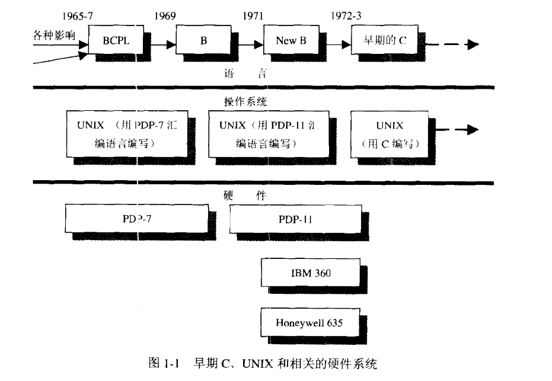

# C专家编程

## 第一章 C:穿越时空的迷雾

#### 1.早期C、Unix和相关的硬件系统




## 第二章 这不是Bug，而是语言特性

///

## 第三章 分析C语言的声明

### 1.用优先级解决声明问题

#### 1.1 优先级规则

```c
A	从名字开始读取，按照优先级顺序读取
B	优先级从高到低：
	B.1	声明中被括号括起来的部分
	B.2 后缀操作符：
		() → 函数
		[] → 数组
    B.3 前缀操作符：
    	* → 指向...的指针
C	const和（或）volatile关键字后紧跟类型说明符（int 、long），那么它作用于
	类型说明符。其他情况，const和（或）volatile作用于它左边紧邻的指针*。
```


### 2.typedef

**typedef**：为一种类型引入新的名字，而不是为变量分配空间，类似于宏文本替换。

##### 2.2 typedef .vs. #define

- 宏类型名扩展；
- 连续变量声明中，typedef定义类型可以保证变量均为同一类型，#define定义类型不能；

```c
#define peach int
#define mapv 1000	//classical usage
typedef int banana;

unsigned peach b = 7; 	// √
unsigned banana c = 3;	// error!
    
```

### 3.术语

类型模型（type model）

typedef (存储类型说明符)

### 4.声明（declarator）

##### 4.1 结构（Struct）

结构就是一种把一些数据组合在一起的数据结构。

结构通常形式：

```c
struct 结构标签(可选)
{
    类型1 标识符1;
    类型2 标识符2;
    ...
}变量定义(可选);
```


##### 4.2 联合(Union)

外表和结构相似，但是在内存布局上存在关键性的区别。

Union

```c
union 标签(可选)
{
    类型1 标识符1;
    类型2 标识符2;
    ...
}变量定义(可选);
```

联合中，所有成员都从偏移地址零开始存储。联合一般被用来节省空间，有些数据项不可能同时存在。

##### 4.3 枚举（Enum）

枚举通过一种简单的途径把一串名字于一串整型值联系在一起；

emum

```c
enum 标签（可选）
{
    内容
}定义变量（可选）;
```


## 第四章 令人震惊的事实：数组和指针并不相同

### 1.声明和定义

C语言中有且仅有一个定义，但可以有多个`extern`声明。

|  1   |             2              |                              3                               |
| :--: | :------------------------: | :----------------------------------------------------------: |
| 定义 | 只能出现在一个地方（一次） |  确定对象的类型并分配内存，用于创建新的对象：int value=10;   |
| 声明 |     可以出现在多个地方     | 描述对象的类型，用于指代其他地方定义的对象：extern int value |

### 2.指针和数组的差异

```c
char * p; // p是一个指针，指针指向的内存存储的是指针的内容
char tp[];// tp自身就是地址
```

相比较于数组，指针的操作需要多一个取地址的过程。


## 第五章 对链接的思考

### 1.动态链接& 静态链接

### 1.1 定义

函数库的拷贝，是可执行文件的物理组成部分，则称为静态链接。

可执行文件只包含文件名，载入器在运行是寻找可执行文件，则称为动态链接。

```c
*.a //a = archive，静态链接库
*.so // shared object 动态链接库
```

​	收集模块准备执行三阶段：链接-编辑（link-editing）、载入（loading）、运行时链接（runtime linking）。静态链接的模块被链接-编辑并载入以便运行。动态链接的模块被链接编辑后载入，并在运行时进行链接以便运行。

### 1.2 ABI

​	动态链接的目的是将程序与其所用的特定函数库版本分离。介于应用程序和函数库二进制可执行文件所提供的服务之间的接口，称之为应用二进制接口（Application Binary Interface,ABI）。

### 1.3 链接器（Linker）

​	编译器创建一个输出文件，这个文件包含可以重定向的对象。这些对象就是与源程序对应的数据和机器指令。

### 1.4 编译器（Compiler)

​	编译器包括（Compiler）：预处理器（Preprocessor）、语法和语义检查器（syntactic and semantic checker）、代码生成器（code generator）、汇编程序（assembler）、优化器（optimizer）、链接器（linker）。

```CQL
-# // 查看编译过程的各个独立阶段
-V // 查看版本信息

```


​	目标文件不能直接执行，需要载入到链接器中。链接器确认main函数为初始进入点，把符号引用（Symbolic Reference）绑定到内存地址，再把所有的目标文件集中在一起，加上库文件，从何产生可执行文件。


## 第六章 运动的诗章：运行时数据结构

### 6.1.a.out

a.out（Assembler Output）汇编输出，实际是连接器输出；

### 2.IntelX86和 Unix段（Segment）的区别

Intelx86中，内存模型设计为64kb大小的模块，一个模块就是一个段。

Unix表示一个二进制文件相关的块；

### 3.Unix 段内容

 Unix段：数据段、bbs段、文本段；

### 6.5 当函数被调用时发生了什么：过程活动记录

1.C语言自动提供的服务—跟踪调用链（哪些函数调用了哪些函数），当下一个return语句执行之后，控制将返回何处。

## 第九章 再论数组

### 9.1 什么时候数组与指针相同

​	实际应用中，数组和指针可以互换的场景比不能互换的场景多。

数组三种声明情况：

- 外部数组（external array）声明；
- 数组的定义（定义是声明的一种特殊情景，分配内存提供初始值）；
- 函数参数的声明；

`所有作为函数参数的数组名总是可以通过编译器转换为指针。`对编译器而言，一个数组就是地址，一个指针是地址的地址。


```c
int narrays[]  = {0,1,2,3};
int arraySize =sizeof(narrays)/sizeof(narrays[0]); // arraySize = 4;

```

**2.数组和指针（不）相同**

```c
/*
不同
*/
// 外部声明
extern char a[10];
// 定义
char a[10];

/*
相同
*/
// 函数形参
void function(char a_[]);
void function_1(char* a_);

// 表达式中使用
char b = a[0];
char b = *(a + index);
```

**3.数组引用**

**规则1：** 表达式中的数组名就是指针

```c
// 对数组的引用a[i]被编译器翻译成*(p+i)
int na[10]={0};
int *pna = na;
int nvalue = na[i];
nvalue == *(pna+i);

```

取下标操作符`[]` 自动将步长调整到数组元素的大小，这就是为什么不使用**sizeof**的原因。

取下标操作符`a[10]` 表示结果和 `10[a]` 相同。


**规则2：** C语言把数组下标作为指针的偏移量

不同方式访问速度问题；

**规则3：** 作为函数参数的数组名等同于指针

| 术语              | 定义                                                         |
| ----------------- | ------------------------------------------------------------ |
| 形参（parameter） | 它是一个变量，在函数定义或函数声明原型中定义，又称为形式参数（formal parameter） |
| 实参（argument）  | 它是一个值，在函数调用时传递给函数的值，又称实际参数（actual parameter） |

编译器只能向函数传递数组的指针而不是整个数组的拷贝。

### 9.6 C语言的多维数组

定义和引用多维数组的唯一方式就是使用多维数组。

```c
// 定义 → 访问 
typedef char Vegetable[20];
Vegetable bo[10];
b0[i][j]= *(*(bo+i)  + j )
```

**数组的数组。**


## 第十章 再论指针

#### 1.多维数组内存分配

内存是线性排列方式，不是表分配方式。

#### 2.指针数组就是Iliffe向量

通过声明一个一维指针数组，每个指针指向一个字符串来获取二维数组的效果。

```c
//sqush[i][j] 可能声明形式
int sqush[4][5]; // int型 二维数组
int *sqush[4]; // int 类型指针的数组Iliffe向量
int **sqush;	// int 类型执行指针的指针
int (*sqush)[5];// 类型为int数组（长度为5）的指针
```

#### 3.锯齿状数组上使用指针


#### 4.向函数传递一个一维数组


#### 5.使用指针向函数传递一个参数


#### 6.使用指针从函数返回一个数组


#### 7.使用指针创建和使用动态数组


## 第十一章 你懂得C，所以C++不在话下

### 11.1 OOP(object-oriented paradigm)概念

| 术语                  | 定义 |      |
| --------------------- | ---- | ---- |
| 抽象(abstraction)     |      |      |
| 类（class)            |      |      |
| 对象（object）        |      |      |
| 封装（encapsulation） |      |      |
| 继承(inheritance)     |      |      |

### 11.2 访问控制

| 控制字    | 描述 |      |
| --------- | ---- | ---- |
| public    |      |      |
| protected |      |      |
| private   |      |      |
| friend    |      |      |
| virtual   |      |      |


# 利用Python进行数据分析

## 第一章 准备工作

### 1.重要Python库

|    Lib     | Discription                                  |
| :--------: | -------------------------------------------- |
|   Numpy    | 科学计算基础包                               |
|   pandas   | 快速便捷地处理结构化数据的大量数据结构和函数 |
| matplotlib | 用于绘制数据图表的Python库                   |
|   SciPy    | 专门解决科学计算中各种标准问题域的包的集合   |
|    ...     | ...                                          |


## 第二章 ipython

```python
"""
	开发环境：python3.7 + anaconda + vs Code + spyder
"""
```

加强版ipython 不是最好的解决方案。


## 第三章 Numpy基础：数组和矢量计算

### 1.Numpy模块功能

- ndarray， 一个具有矢量算术运算和复杂广播能力的快速且节省空间的多维数
  组。
- 用于对整组数据进行快速运算的标准数学函数（ 无需编写循环） 。
- 用于读写磁盘数据的工具以及用于操作内存映射文件的工具。
- 线性代数、 随机数生成以及傅里叶变换功能。
- 用于集成由C、 C++、 Fortran等语言编写的代码的A C API。  

### 2.算法耗时分析

https://selfboot.cn/2016/06/13/python_performance_analysis/

### 3.Numpy的ndarray

#### 定义

ndarray：N维数组对象，快速而灵活的大数据集容器。

面向数组的编程和思维方式。

#### 创建ndarray

1.array—函数

array接受一切序列型数据对象，并将其转换为数组。


#### ndarray属性

| Property | Discription  | Other |
| -------- | ------------ | ----- |
| ndim     | 数组维度     |       |
| shape    | 数组形状     |       |
| dtype    | 数组数据类型 |       |


#### 2.其他

`zeros` 、`ones` 、`empty`创建。`empty`创建没有任何具体值的数组。要使用上述函数进行数组创建，只需要传入表示形状的元组。

| 函数              | 描述                                             | 其他           |
| ----------------- | ------------------------------------------------ | -------------- |
| zeros，zeros_like | 创建全零数组                                     |                |
| ones，ones_like   | 创建全1数组                                      |                |
| empty，empty_like | 分配内存，不填充数值                             | like：数组形状 |
| array             | 输入数据转换为数组                               |                |
| asarray           |                                                  |                |
| arange            | 类似于range函数                                  |                |
| full，full_like   | 用fill value中的所有值，根据shape和dtype创建数组 |                |
| eye，identity     | N*N单位对角矩阵                                  |                |
| ...               | ...                                              | ...            |


### 3.ndarray数据类型

dtype（ 数据类型） 是一个特殊的对象  。

- 数据类型
- 数据类型转换astype


### 4.Numpy数组的运算

#### 4.1 矢量化

矢量化（Vectorization）:大小相等数组之间的任何算数运算都会被应用到元素级。

**数组乘法**

```python
# python 
>>> a = np.array([1,2,3],[4,5,6])
>>> a*a
```


```matlab
% matlab
a = [[1,2,3];[4,5,6]]
a.*a 
```

**数组与标量运算**

**数组比较**

```python
>>> a = np.array([1,2,3])
>>> b = np.array([4,2,2])
>>> c = a>b

```


**广播(Broadcasting) **

大小不同数组之间的运算。

#### 4.2 切片与索引

切片方法`:` 。

```python
array[startIndex:endIndex]

```

切片使用标量赋值会自动广播到整个选区。

```python
arr_a = np.arange(10)
arr_aslice = arr_a[3:5]
arr_aslice = 1
```

对切片进行单值修改会体现在原始数组中。

数组显示复制而非切片视图。

切片复制：

```python
# 切片复制
arr_ascopy = arr_aslice.copy()
```


二维数组索引方式

```python
arr_tw = np.array([[1,2],[3,4]])

```

#### 4.3布尔型索引

通过bool数组进行索引；布尔型数组的长度必须跟被索引的轴长度一致。此外， 还可以将布尔型数组跟切片、 整数（ 或整数序列） 混合使用 。

```python
def boolIndex():
    print('bool index explore')
    arr_str = np.array(["bob","jack","nei","ham"])
    arr_randn = np.random.randn(4,7)
    name_bool = arr_str == 'bob'
    ah = arr_randn[name_bool]
    print(ah)
```

通过布尔型索引选取数组中的数据， 将总是创建数据的副本， 即使返回一模一样的
数组也是如此。
`注意` Python关键字and和or在布尔型数组中无效。 要使用&与|  。

#### 4.4 花式索引（Fancy indexing）

指利用整个数组进行索引。花式索引跟切片不一样， 它总是将数据复制到新数组中 。


#### 4.5 数组转置与轴对换

转置是重塑的一种特殊形式， 它返回的是源数据的视图（ 不会进行任何复制操作） 。对于高维数组，`transpose`需要得到一个由轴编号组成的元组才能对这些轴进行转置。简单的转置可以使用`.T`。

| 转置      |                          |      |
| --------- | ------------------------ | ---- |
| transpose | 转置是重塑的一种特殊形式 |      |
| T         | 轴对称变换               |      |
| swapaxes  |                          |      |

#### 4.6 通用函数：快速的元素级数组函数

通用函数（即ufunc）是一种对ndarray中的数据执行元素级运算的函数。


#### 4.7 利用数组进行数据处理

`矢量化`：用数组表达式代替循环的做法，通常被称为矢量化。

三元表达式：

```python
# python 实现方式
x if condition else y

#where 函数
np.where(cond,x,y)

```

#### 4.8 数学和统计方法

可以通过数组上的一组数学函数对整个数组或某个轴向的数据进行统计计算。sum、mean以及标准差std等聚合计算 （aggregation，通常叫做约简（reduction））既可以当做数组的`实例方法调用`，也可以当做`顶级NumPy函数使用`。

**基本数组统计方法**

| 方法           | 说明                                       |
| -------------- | ------------------------------------------ |
| sum            | 数组全部或者某轴向求和，零长度数组sum为0； |
| mean           | 算术平均数；零长度为NaN                    |
| std、var       | 标准差和方差，自由度可调整；               |
| min、max       | 最大值和最小值；                           |
| argmin、argmax | 最大值、最小值索引；                       |
| cumsum         | 所有元素累计和                             |
| cumprod        | 所有元素的累计积                           |
| ...            | ...                                        |

#### 4.9 用于bool型数组的方法

通用方法中，`True` 转换为`1`，`False `转换为`0`；

| 方法 | 说明             |
| ---- | ---------------- |
| sum  | 求所有True的个数 |
| any  | 至少存在一个True |
| all  | 是否所有都为True |

用于`非布尔型`数据，非0元素转换为1；


#### 4.10 排序

`sort()`

#### 4.11 唯一化以及其他的集合逻辑

| 方法             | 说明                              |
| ---------------- | --------------------------------- |
| unique(x)        | 计算x中的唯一元素，并返回有序结果 |
| intersect1d(x,y) | 计算x和y中公共元素，返回有序结果  |
| union1s(x,y)     | 计算x和y中的并集，并返回有序结果  |
| in1d(x,y)        | x的元素是否包含于y的布尔型数组    |
| setdiff1d(x,y)   | 集合的差，元素x不在y中            |
| setxor1d(x,y)    | 集合的对称性，xor函数             |
| ...              | ...                               |

#### 4.12 用于数组的文件输入输出

load()

save()

#### 4.13 线性代数

`nunpy.linalg`中有一组标准的矩阵分解运算以及诸如求逆和行列式之类的东西。它们跟MATLAB和R等语言所使用的是相同的行业标准级Fortran库，如BLAS、LAPACK、Intel MKL（可能有，取决于你的NumPy版本）等。


#### 4.14 随机数

`umpy.random`模块对Python内置的random进行了补充，增加了一些用于高效生成多种概率分布的样本值的函数。


## 第四章 pandas入门

### 1.数据结构介绍

两个主要数据结构：`Series`和`DataFrame`。

Series是一种类似于一维数组的对象，它由一组数据（各种NumPy数据类型）以及一组与之相关的数据标签（即索引）组成。

#### 1.1 Series

- 数据结构定义
- 数据索引
- numpy 对比
- 字典
- 数据缺失（检查`isnull` & `notnull` ）
- 根据索引对齐数据
- 索引修改

#### 1.2 DataFrame

DataFrame是一个表格型的数据结构，它含有一组有序的列，每列可以是不同的值类型（数值、字符串、布尔值等）。 DataFrame既有行索引也有列索引，它可以被看做由Series组 成的字典（共用同一个索引）。


# sword means offer

## 1.Rope


动态规划&贪心算法

<https://github.com/Checkson/blog/issues/34>

<https://liweiwei1419.github.io/sword-for-offer/14-%E5%89%AA%E7%BB%B3%E5%AD%90/>

https://blog.csdn.net/qq_16234613/article/details/52235082


**https://web.stanford.edu/class/cs97si/**

## 2.非符号运算加

1.异或&同或

${a⊙b = ab + a'b'}$

$a $^$ b = a'b + b'a​$

2.位运算

https://blog.nowcoder.net/n/dcbca76d214744a9a1644ae54a183549

https://segmentfault.com/a/1190000015796106


## 3.NoteDepth

1.https://www.cnblogs.com/aademeng/articles/11309253.html

2.https://www.cnblogs.com/edisonchou/p/4823213.html

