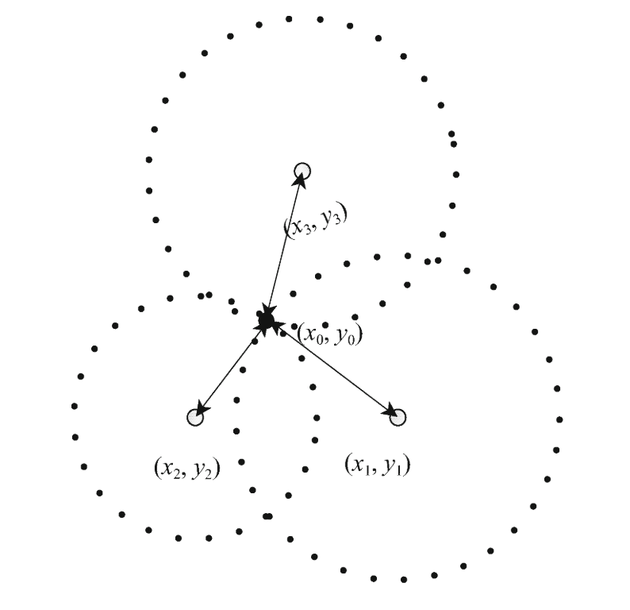
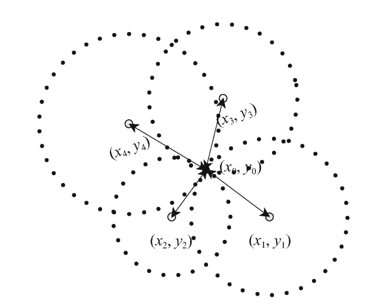
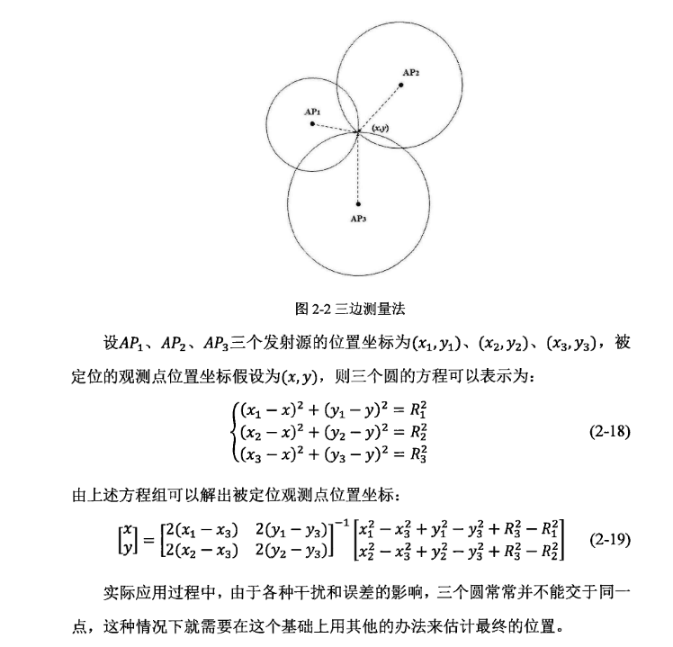
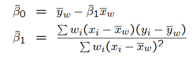
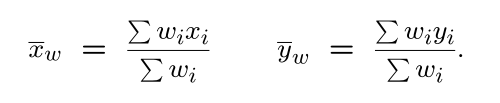
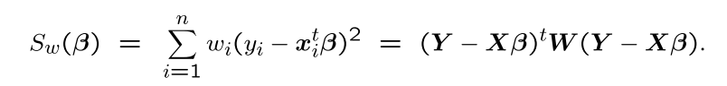
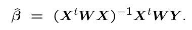
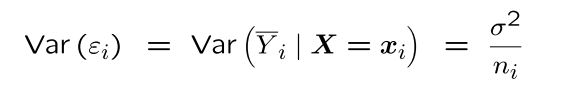
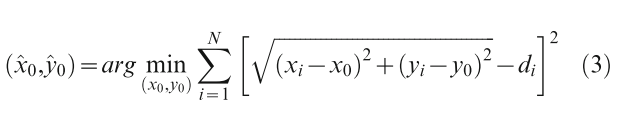
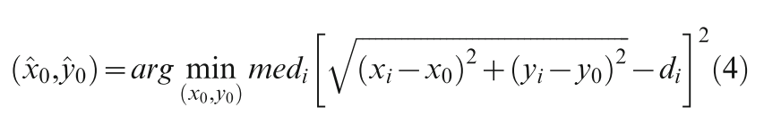

# Trilateration

## 问题描述

​	分布均匀的无线传感器网络由一组节点组成，包括锚节点(anchor nodes)和未知节点(unknown nodes)。每个节点都配备有信号收发器，当它们之间的欧式距离(Euclidean distance)小于特定的范围，可以进行通信。每个节点都可以通过某些测距技术（例如TDOA，RSSI或DV-HOP）测量到其他节点的距离。观测距离结果用公式（1）表示，其中${N(0,VD)}$ 是高斯白噪声。
$$
\begin{align}
& d_{measured} = d_{deal} + noise,noisen  \~  N(0,VD)
\end{align}
$$
​	假定一坐标为${(x_0,y_0)}$ 的未知结点 接收到N个信号 ${(x_1,y_1,d_1),...,(x_2,y_2,d_N)}$，理想条件下，有如下公式：
$$
\begin{align}
(x_1-x_0)^2 &+ (y_1-y_0)^2 = d_1^2 \\
(x_2-x_0)^2 &+ (y_2-y_0)^2 = d_2^2 \\
&.\\&.\\
(x_N-x_0)^2 &+ (y_N-y_0)^2 = d_N^2 \\
\end{align}
$$

如果$N \geq 3$ ，且锚节点不在同一条直线上，则能通过求解任意三个公式得到${(x_0,y_0)}$ 的值。

## 经典三边测距法（classical trilateration algorithm）

三边测距法中，二维平面中的解是以三个锚点为中心的三个圆的交点。如图一，实际上，所有以${(x_i,x_i)}$ 为圆心，以${d_i}$ 为半径的圆的交点为${(x_0,y_0)}$。然后，真实环境中， 这N个圆可能并不是相交于一个点，因此通常使用公式（3）中描述的目标函数来最小化未知节点的估计位置与实际位置之间的差异。 该方法即是最小二乘经典三边测距算法。

在正常条件中使用LS（least square）进行多边测试效果不错。 

但是如果存在较大噪声干扰下， 坐标估计值与真实坐标偏差会受到较大影响；

三边定位法计算方法：

## OLS（ordinary least square）

线性回归模型：
$$
\begin{align}
&\hat y = \beta x_i + \beta_0
\end{align}
$$

${y_i}$，表示数据${x_i}$的观测结果，即真实值，或者是观测的响应变量（observed response）；
${x_i}$，表示第${i}$个数据，即第${i}$个预测变量（predictor value）；
${\hat{y}_i}$，表示第${i}$个数据的实验结果，即预测的响应变量（predicted response）。

线性模型的形式：
$$
\begin{align}
& &\hat y = X\beta^T
\end{align}
$$
线性回归的目的是使目标函数最小：
$$
\begin{align}
& \hat{\beta} = argmin_{\beta}S(\beta)\\
&	S(\beta) = \sum_{i=1}^m|y_i - \sum_{j=1}^nx_{ij}\beta_j|^2=||y-X\beta^T||^2
\end{align}
$$

普通最小二乘法要求残差满足Gauss-Markov假设，即：
$$
\begin{align}
&E(β0)=0\\
&Cov(\beta_0) = \sigma^2I\\
&Cov(\beta_0, x) = 0
\end{align}
$$
残差的期望为0，协方差是单位矩阵，与自变量的协方差为0。

## WLS(weighted least squares)

### #1 OLS假设

​	标准的线性回归假定残差满足Gauss-Markov假设即：${Var(\epsilon_i) = \delta^2,i=1...n.}$。然后，实际存在以下情况：

${Var(Y|X=x_i)=Var(\epsilon_i) = \frac{\delta^2}{\omega_i}}$，其中${\omega_i}$ 为正常数。加权最小二乘是一种估计方法，它将与观测值的误差方差的倒数成比例的方式对观测值进行加权，从而克服了异方差的问题。

### #2 WLS简单回归

​	假设存在以下模型：
$$
\begin{align}
&Y_i = \beta_0 + \beta_1X_i + \epsilon_i,i=1,...,n\\
& 其中，\epsilon_i~N(0,\delta^2/\omega_i)，且\omega_i为**已知**常量；
\end{align}
$$
β0和β1的加权最小二乘估计使得其最小：
$$
\begin{align}
& S_w(\beta_0,\beta_1) = \sum_{i=1}^n\omega_i(y_i-\beta_0-\beta_1x_i)^2\\
\end{align}
$$
在这个加权平方和中，权重与相应的方差成反比； 方差小的点将被赋予较高的权重，方差较大的点将被赋予较低的权重。

加权最小二乘估计值如下：

其中：

加权最小二乘同样是无偏估计。

### #3 WLS一般解法

​	${W}$ 是对角元数为${w_1,...w_n}$的对角矩阵。加权残差平方和定义为：

加权最小二乘可通过最小化平方和来找到β的估计值，其解为：

### #4 加权最小二乘变换

### #5 加权最小二乘的优点

- 在转换后的模型中，系数估计的可能很困难。 在加权最小二乘中，解释与以前相同。
- 在转换后的模型中，通常不会出现截距，这意味着F检验和R平方值相当不同。 在加权最小二乘中，我们通常包括保留对这些数量的通常解释的截距。
- 加权最小二乘设置权重等于0，为我们提供了一种从模型中删除一个观测值的简便方法。
- 我们还可以降低异常值或有影响力的点，以减少它们对整体模式的影响。

### #6 权重系数

​	为了使用加权最小二乘，必须事先知道其权重系数。一些情况下，我们可能有一个概率模型${Var(Y|X=x_i)=Var(\epsilon_i) = \frac{\delta^2}{\omega_i}}$来求解其系数值${w_i}$。例如，对于泊松数据，如果期望${x}$和${Var(Y|X=x_i)}$满足正相关，我们可以使用${w_i=1/x_i}$作为系数。

​	另一个常见的情况是，每个观察值都不是单一度量，而是多个原始度量的均值且原始度量均具有方差σ2。在这种情况下，

因此，我们将使用加权的最小二乘法系数为${w_i=n_i}$；这种情况通常发生在集群调查中（ `cluster surveys`）。

### #7 未知权重

## LS（least square）

​	基于均方误差最小化来进行模型求解的方法称 为"最小二乘法" (least squqare method)。用LS进行多边定位是为了最大程度地减少估计位置$(\hat{x}_0 ,\hat{y}_0)$与节点的实际位置${(x_0,y_0)}$之间的差异。该方法通常涉及迭代搜索技术，例如梯度下降或牛顿法。为了避免出现局部最小值，LS必须以不同的初始起点多次运算，这会导致计算消耗大。 此外，它很容易受到位置偏移的影响，因为它试图在所有样本（包括那些大偏差样本）上实现全局最优。

## LMS(Least median squares)

## Linear LMS(Linear Least median squares)

$@Book{Gao2017SLAM, title={视觉SLAM十四讲：从理论到实践}, publisher = {电子工业出版社}, year = {2017}, author = {高翔 and 张涛 and 刘毅 and 颜沁睿}, lang = {zh} }$

## Reference

1. [Trilateration三边测量定位算法](https://www.cnblogs.com/sddai/p/5663463.html)
2. 最小二乘 https://zhuanlan.zhihu.com/p/38128785
3. [最小二乘问题的四种解法——牛顿法，梯度下降法，高斯牛顿法和列文伯格-马夸特法的区别和联系](https://zhuanlan.zhihu.com/p/113946848)
4. 最小二乘法定位（2）——定位算法+仿真程序https://blog.csdn.net/qq_30093417/article/details/88944169
5. 最小二乘法节点定位（1）——小知识：非线性方程线性化https://blog.csdn.net/qq_30093417/article/details/86681364
6. 使用三边定位算法进行室内定位https://blog.csdn.net/huangzhichang13/article/details/76076958
7. 使用三邊定位演算法進行室內定位https://www.itread01.com/content/1546576765.html
8. 采用三边定位算法对未知节点进行估算https://www.cnblogs.com/Aaron12/p/7646841.html
9. [数值分析](http://www.math.ecnu.edu.cn/~jypan/Teaching/NA/index.html)
10. IndoorPos https://codechina.csdn.net/mirrors/megagao/indoorpos?utm_source=csdn_github_accelerator
11. An Algebraic Solution to the Multilateration Problem https://www.researchgate.net/publication/275027725_An_Algebraic_Solution_to_the_Multilateration_Problem
12. matlab优化工具箱 https://ww2.mathworks.cn/help/optim/index.html?s_cid=doc_ftr
13. [梯度下降法(梯度下降法，牛顿法，高斯牛顿法，Levenberg-Marquardt算法)](https://www.cnblogs.com/zhizhan/p/5279672.html)
14. 高斯牛顿算法 https://en.m.wikipedia.org/wiki/Gauss%E2%80%93Newton_algorithm 
15. [MATLAB 高斯牛顿法最优化](https://www.cnblogs.com/ybqjymy/p/13645624.html)
16. [matlab实现高斯牛顿法、Levenberg–Marquardt方法](https://www.cnblogs.com/wsine/p/4634581.html)
17. [Jacobian矩阵和Hessian矩阵](http://jacoxu.com/jacobian%e7%9f%a9%e9%98%b5%e5%92%8chessian%e7%9f%a9%e9%98%b5/)
18. [最小二乘法（Least Squares）详细介绍 | 数据学习者官方网站(Datalearner)](https://www.datalearner.com/blog/1051539222770649)
19. [高斯-马尔可夫定理 - 维基百科，自由的百科全书 (wikipedia.org)](https://zh.wikipedia.org/wiki/高斯-马尔可夫定理)
20. wls[Lectures7.pdf (mcmaster.ca)](https://ms.mcmaster.ca/canty/teaching/stat3a03/Lectures7.pdf)
21. [Welcome to STAT 501! | STAT 501 (psu.edu)](https://online.stat.psu.edu/stat501/lesson/welcome-stat-501)