# 比特币：我们所知的货币结局

金钱和权力一直是人类的中心。

## 区块链

比特币中使用到的关键技术之一。

### 区块

将总账本（交易记录）拆分为小的区块进行存储，由总账本进行拆分后的小信息块。

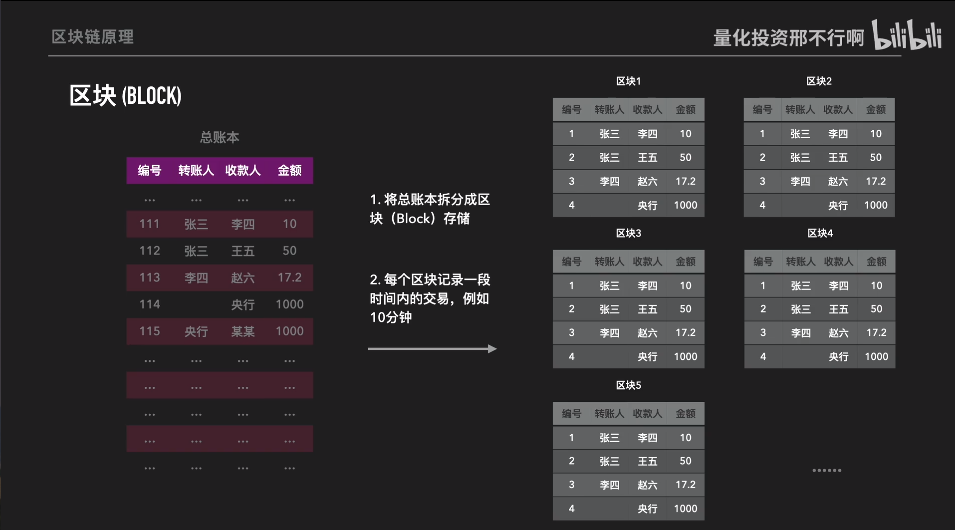

### 区块链

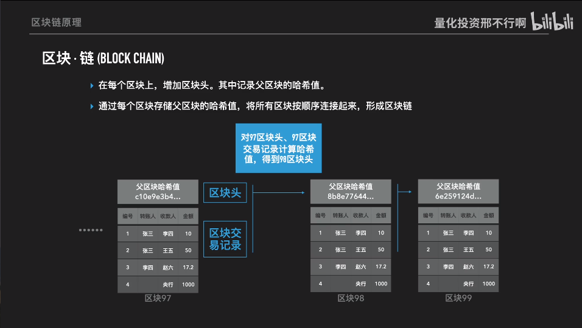

1.区块链

- 每个区块包括：交易记录、父区块的hash值；
- 核心技术：密码学+数据结构，保证账本记录不可篡改；
- 本质：链表，公开的账本，只记录交易；
- 核心功能：创造信任。法币基于政府的公信力，比特币依靠技术；

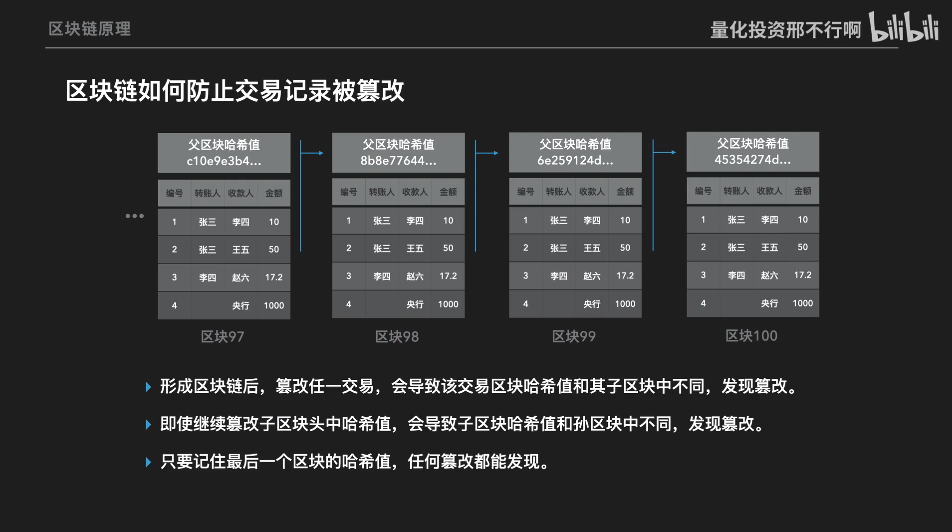

2.区块链如何实现交易记录不被修改

- 形成区块链后，篡改任一交易，会导致该交易区块哈希值和其子区块中不同，出现链式效应，后面区块的哈希值出现不一致情况；
- 只要记住最后一个区块的哈希值，任何篡改都能够被发现；
- 如何发现具体的修改内容
- 双重(花)支付。。。。？？

3.比特币区块网站

[Blockchain Explorer - Search the Blockchain | BTC | ETH | BCH](https://www.blockchain.com/explorer?utm_campaign=dcommarketing_view)

4.如何通过区块链进行交易

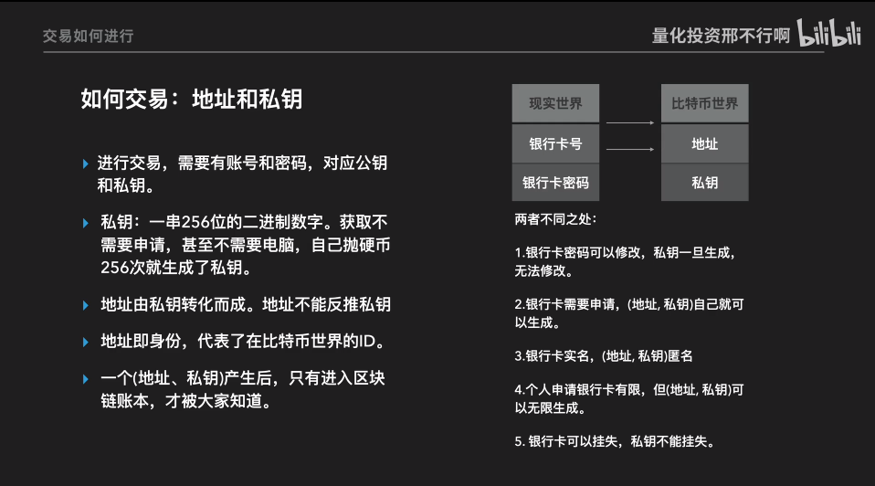

只有将交易加入到账本中，交易才算有效；

进行交易需要账号（公钥）密码（私钥）。

公钥和私钥：

公钥→账号，私钥→密码；

私钥：一串256位的二进制数字。

地址：代表了比特币世界的ID。

5.数字签名技术

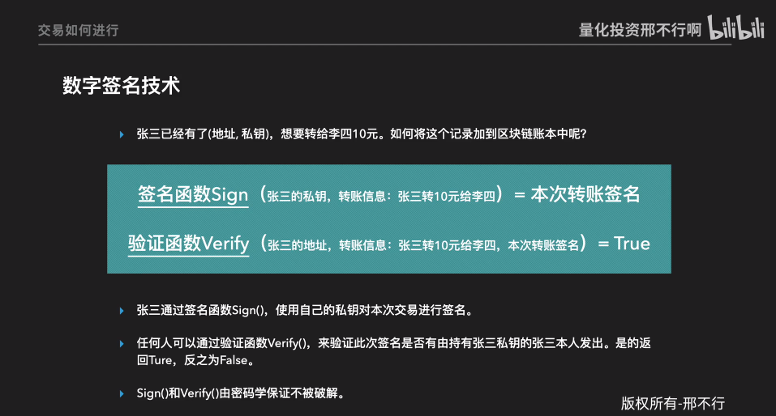

关键技术：不对称加密技术；

*张三的钱是怎么来的？*

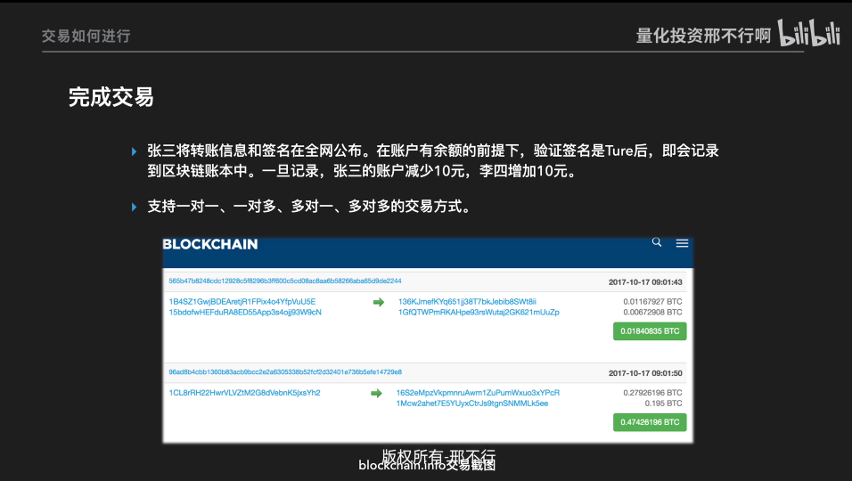

*账户有余额怎么判断？*

*钱包APP密钥*

6.中心化记账

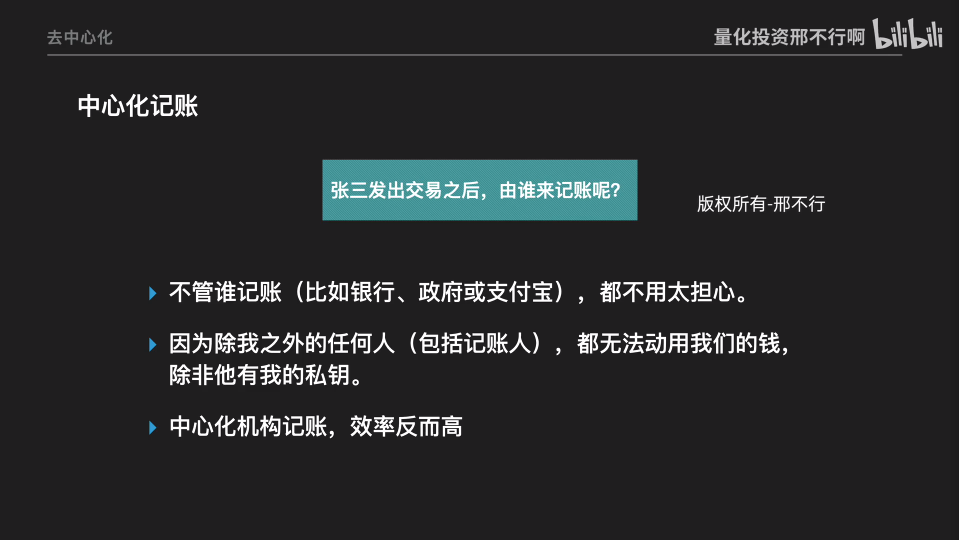

中心化记账的缺点

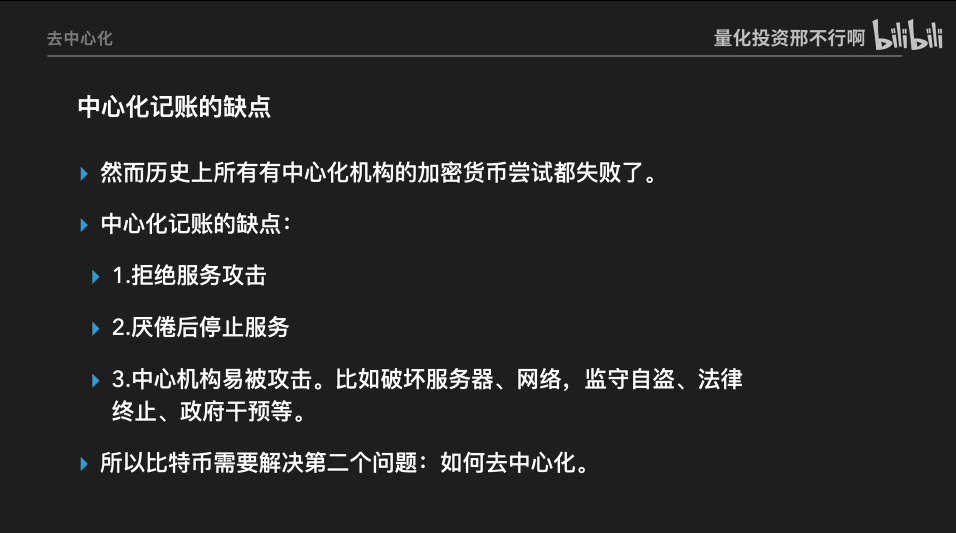

Peer-2-Peer

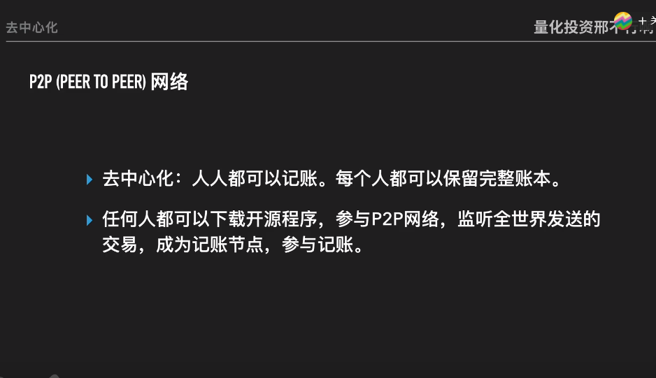

具体的交易过程

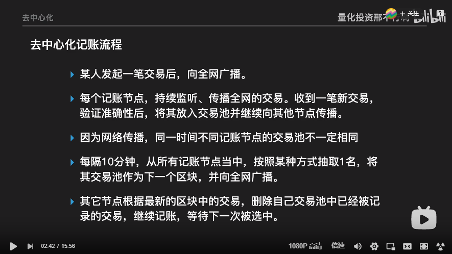

交易池？

交易被记录~=交易

交易+手续费

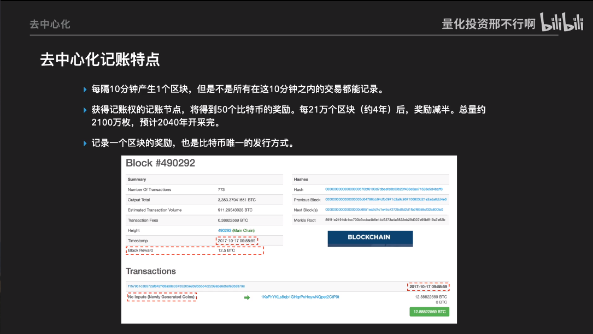

如何分配记账权proof of work-POW

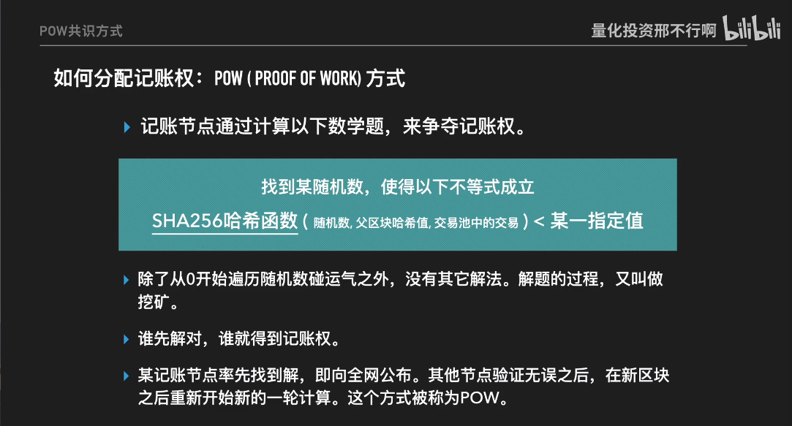

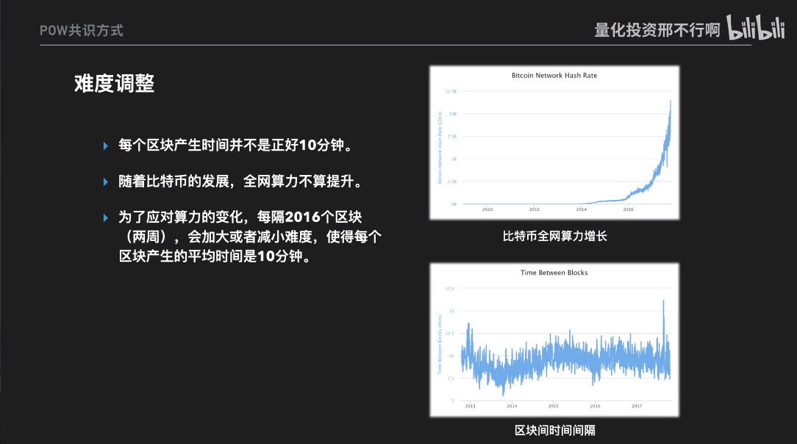

 动态调整保证平均难度时间：10min。

7.比特币全貌

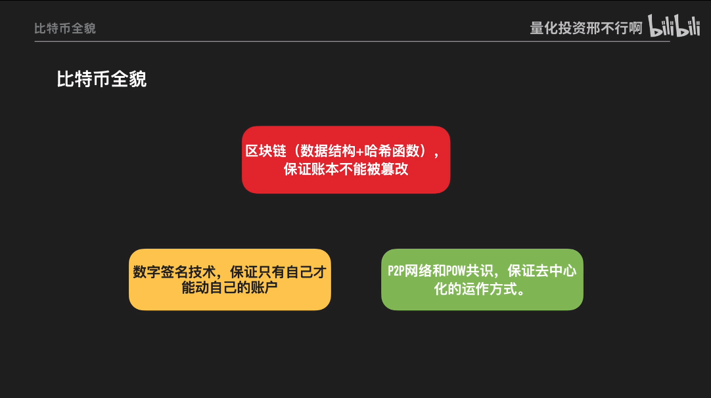

*记账的单一性*

*最终结算*

*比特币买卖*的本质；

## 比特币攻击

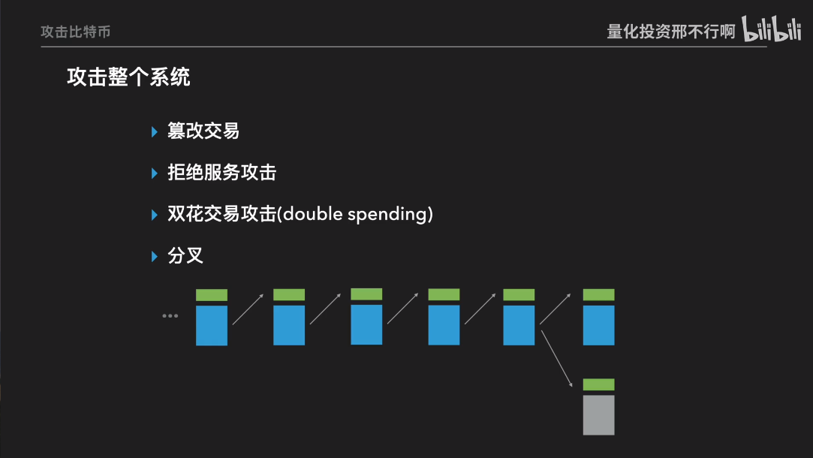

**篡改交易**

账本去中心化， 存储于每一个节点电脑上，篡改难度很大。

**拒绝服务攻击**

去中心化。

**双花交易（double speeding）**

通过一时间产生两笔交易。

假设一：同一矿工接收到两笔交易

矿工进行账户校验

假设二：不同矿工接收到，且其中一比交易已经被打包进区块链（交易完成）

未打包矿工校验已经完成的区块链，排除掉此条交易信息。

*如何验证交易的*

*如何验证账户余额*

**分叉**

一个父区块产生两个子区块，不同矿工沿着不同的叉链生成链。最长链原则，以最长链做为准则。

*挖矿奖励作废*

**51%攻击**

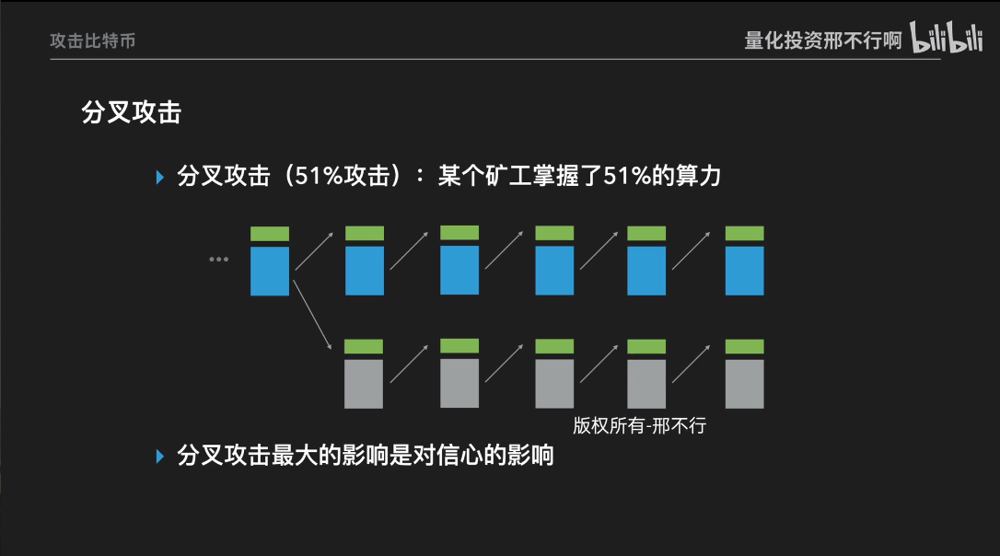

某个矿工掌握了51%及以上的算力后比特币不再安全。 分叉攻击最大的影响是对信心（信任）的影响。

*纳什均衡*

## 比特币的历史和未来

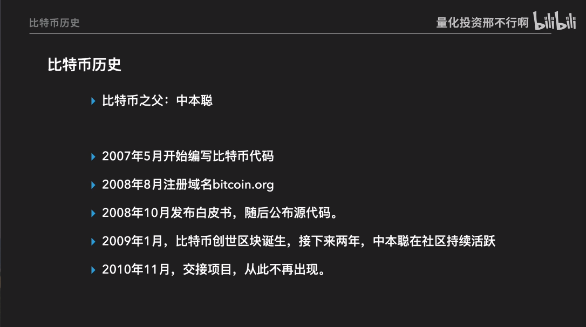

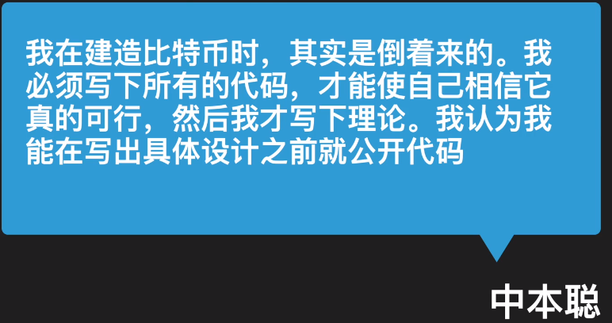

