# Towards Intelligent PID Control

[Towards intelligent PID control - ScienceDirect](https://www.sciencedirect.com/science/article/abs/pii/0066413889900104)

https://doi.org/10.1016/0066-4138(89)90010-4

**摘要**

​	PID控制器的自整定器已经出现了几年了。这些自整器正在自动执行通常由仪器工程师执行的任务。自整定器包括从实验中提取过程动态的技术和控制设计方法。它们甚至可以自动选择使用 PI或 PID 控制。对于更高程度的自动化，还需要自整定器替代过程工程师的工作。为此，必须为控制器提供推理能力。单回路控制器中算力的增强使得这变成了可能。本文介绍了具有这种推理能力的 pid 控制器。

## 1.Introduction

In the design of an intelligent or knowledge based  feedback controller (Astrijm et al 1986, &&n 1987,  lQ88), it would be desirable to incorporate the expert  knowledge of design engineers so that it can make  decisions on the choice of control algorithm and  provide diagnostics on the effectiveness of the control  system. A system with such facilities would make  the task of the operator and the instrument engineer  more interesting. It would also make it possible for  the instrument engineer to improve the reasoning of  the system. For real-time implementation it would  also be desirable to have as much deep knowledge  as possible, in place of large number of possibly  conflicting rules. It would also be desirable that the  controller to a limited degree could explain its own  reasoning, e.g. why derivative action was used.
 It should also be able to tell if PID is appropriate in the  particular case and possibly also suggest alternative  control schemes. 

在智能或基于知识的反馈控制器的设计中（.A,ström ct al 1986, Å.rz?n 198?, 1988），需要结合设计工程师的专业知识，以便它可以选择控制算法并对控制系统有效性进行诊断。具有此类装置的系统将使操作员和仪器工程师的任务更加有趣。 同时，也有助于仪器工程师改进系统的推理能力。对于实时应用，还希望拥有尽可能多的深入知识，以代替大量可能相互冲突的规则。 此外，控制器在要能在有限程度上可以解释其推理，例如 为什么使用微分。 它还应该能够判断 PID 在特定情况下是否合适，并能给出可行的替代方案。

In this paper we attempt to develop formal tools  to assess what can be achieved by PID control of a  class of systems with the Ziegler-Nichols tuning formula and to characterbe a class of systems where 
PID control is appropriate. Based on empirical results and approximate analytical study, we introduce  two numbers, namely the normalized dead time **θ** and  the normalized process gain **K**, to characterize the  open loop process dynamics and two numbers, the  peak load error **λ** and the normalized rise time **τ**, to  characterize the closed loop response. Simple methods of measuring these parameters are proposed. It is shown that **θ** and **K **  are related and either of them can be used to predict the achievable performance  of PID controllers tuned by the Ziegler-Nichols formula. Using these relations the intelligent controller  can thus interact with the operator and advise on  choice of control algorithm. 

在本文中，我们尝试开发一个工具来评估Ziegler-Nichols 方法对一类使用PID控制的系统的整定效果并评定PID控制在哪些系统中是适用的。基于实证结果和近似分析研究，引入归一化死区时间θ和过程增益**k**，评定开环动态过程了。引入峰值负载误差λ和归一化上升时间τ，评定闭环相应。提出了一种简单的测量这些参数的方法。结果表明，θ和K是相关的，它们中的任何一个都可以用来预测通过 Ziegler-Nichols 公式调整的 PID 控制器的可实现性能。基于这些关系，智能控制器可以与操作员交互并就控制算法的选择提出建议。

We have established useful relations, which can be used to assess whether the PID controller is properly tuned. The simplicity of the relations allows the  development of a first generation of intelligent controllers using current technology. Significant insight  into the properties and heuristic aspects of PID control is gained. Such knowledge can be formally discussed and further refined. It is believed that the approach can be extended to other classes of systems  and this is a topic of current research. 

我们已经建立了用于评估 PID 控制器是否正确调整有用的关系。 关系的简单性允许使用当前技术开发第一代智能控制器。 获得了对 PID 控制的特性和启发式方面的重要见解。 这些知识有待正式讨论和进一步完善。 相信该方法可以扩展到其他类别的系统，这是当前研究的热点。 

The paper is organized as follows. The restricted  class of processes that we are concerned with is  introduced in Section 2.Some useful dimensionless numbers are introduced in Section 3. In Sections 4 and 5 some relations between the features are derived by approximate analysis and empirical refinement based on simulation. The results are used in Section 6 to discuss the performance that may be achieved with PID control based on Ziegler-Nichols tuning. Some characteristics are given in Section 7.

本文的结构如下。 第 2 节介绍相关有限过程类。第 3 节介绍了一些有用的无量纲数。 在第 4 节和第 5 节中，通过近似分析和基于模拟的经验细化推导出特征之间的一些关系。在第 6 节中讨论基于 Ziegler-Nichols 调整的 PID 控制可能达到的效果。 第 7 节给出了一些特征。

## 2.Process Characteristics 

It is assumed that the process dynamics is linear and  stable. The characteristics will be further restricted  both in the time and the frequency domain. Feedback  with simple controllers only is considered.

假设过程动力学是线性且稳定的。 这些特性在时域和频域上都将受到进一步的限制。 仅考虑使用简单控制器的反馈。 

### Time Domain Characterization（时域特征）

It will be assumed that the step response is monotone  or essentially monotone, i.e. monotone except for a  small initial part. Such systems can be characterized  by the parameters $K_p$, $L$, and $T$, where $Kp$ is the  static process gain, $L$ is the apparent dead time and the $L$ is the apparent  time constant. The parameters T and L are obtained by graphical construction, where the tangent is drawn in the inection point  of the step response. The transfer function is a crude analytic approximation of the the transfer function of the class of processes that we are considering. Notice however that the transfer functions considered are not restricted to this class. 

假定阶跃响应是单调的或基本上是单调的，即除了小的初始部分之外是单调的。此类系统可以通过参数 Kp、L 和 T 来表征，其中 Kp 是静态过程增益，L 是死区时间， T 是时间常数。 参数 T 和 L 是通过构造图形获得的，其中切线绘制在阶跃响应的拐点处。 系统传递函数：

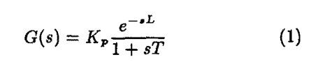

是正在分析的一类过程的传递函数的粗略分析近似。 但是，所考虑的传递函数不限于此类。 

The class of systems considered is the same as  that used in the classical works on Ziegler-Nichols tuning. 
There are important classes of systems that are excluded, e.g., systems having integrators and systems with resonant poles. Systems having integrators may have monotone step responses but they are not stable. Systems with resonant poles do not have essentially monotone step response. 

所考虑的系统类别与齐格勒-尼科尔斯整定的经典著作中使用的系统类别相同。有一些重要的系统类别被排除在外，例如，具有积分器的系统和具有谐振极点的系统。 具有积分器的系统可能具有单调的阶跃响应，但它们并不稳定。 具有谐振极点的系统基本上没有单调的阶跃响应。 

### Frequency Domain Characterization(频域特征)

A different frequency domain characterization of process dynamics will also be introduced. It is assumed 
that the Nyquist curve is monotone or essentially monotone, i.e. both the phase and the amplitude are monotone functions of the frequency. The first intersection with the negative real axis defines the ultimate frequency, $\omega_u$, and the ultimate gain, $K_{u}$. Lack of monotonicity can be accepted at frequencies, 
where the phase shift is larger than 180’.

接下来介绍系统的频域特征，假设奈奎斯特曲线是单调的或本质上是单调的，即相位和幅度都是频率的单调函数。与负实轴的第一个交点定义了 极限频率  $\omega_u$, 和极限增益 $K_{u}$。在相移大于 180° 的频率处可以认为不具有单调性。 

## 3.feature

Dimension-free parameters, like Reynold’s numbers, have found much use in many branches of engineering. They have however not been much used in automatic control. In this section it is attempted to  introduce some numbers that are useful in assessing control system performance. 

无量纲参数，如雷诺数， 在工程的许多分支中被广泛应用。然而，它们在自动控制中的应用并不多。 在本节中，将介绍一些对评估控制系统性能的参数。 

### 归一化死区时间

he normalized dead-time is defined as the ratio  of the apparent dead-time and the apparent time  constant, or formally:

归一化死区时间定义为死区时间与时间常数的比值，表达式如下：

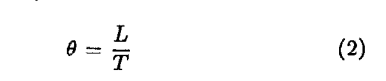

This number is thus easily obtained from a record  of the step response. It has been known from practical experience that the normalized dead-time may  be used as a measure of the diffculty of controlling a  process. Processes with a small θ are easy to control and processes with a large θ are difficult to control. 
The parameter θ was actually called the controllability ratio by Deshpande and Ash (1981). Fertik (1975)

这个数字很容易通过阶跃响应的获得。 从实践经验中可知，标准化的死区时间可以用来衡量控制过程的难易程度。θ较小过程很容易控制，θ大的过程难以控制。参数θ实际上被 Deshpande Ash 称为可控性比。Fertik引入 θ/(1+ θ)作为过程可控性度量。为了避免与现代控制理论的标准术语混淆，我们将使用归一化死区时间这个词。 

### 归一化过程增益 

The process gain $Kp$ is not dimension-free. It can however be made dimension free by multiplication with a suitable controller gain. The ultimate gain $K_{u}$,, i.e., the controller gain that makes the process 
unstable under proportional feedback control, is a suitable normalization factor. The normalized process gain ${K}$, can be defined as :

过程增益$Kp$ 是有量纲的。可以通过与控制器增益相乘变成无量纲量。极限增益$K_u$就是当比例反馈控制下，让系统处于不稳定状态时候的增益，是一个合适的归一因子。归一化过程增益$K$定义如下：

This number is easily obtained from the Nyquist  curve.It also has a physical interpretation as the  largest process loop gain that can be achieved under proportional control. The number is useful to assess  the control performance. Roughly speaking, a large value indicates that the process is easy to control while a small value indicates that the process is difficult to control.

这个数字很容易从奈奎斯特曲线中获得。它还具有物理可解释性，即在比例控制下可以实现的最大过程回路增益。该数字有助于评估控制性能。 粗略地说，值大表示过程容易控制 而较小的值表示该过程难以控制。 

The normalized process gain is directly obtained  from a Nyquist curve of the process. It can also be  obtained from an experiment with relay feedback, see  &tram and Hiigglund (1984). 

归一化过程增益直接从过程的奈奎斯特曲线获得。 它也可以从继电器反馈的实验中获得，参见 &tram 和 Hiigglund (1984)。 

Since the processes we consider are stable they  have a static error under proportional feedback. The  static error obtained for a unit step command 

由于我们考虑的过程是稳定的，因此它们在比例反馈控制下存在稳态误差。 单位阶跃输入相应的稳态误差：

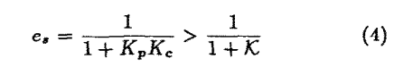

where KC is the proportional gain used. The inequality follows because K,K, < X. The number K: can thus be used to estimate the static error achievable under proportional control and also to determine if integral action is required to satisfy the specifications  on static error. 

其中$K_c$是使用的比例增益。 不等式如下，因为 $K_p*K_c<K$。因此，参数$K$: 可用于估计在比例控制下可实现的稳态误差，也可用于确定是否需要积分作用来满足对稳态错误的要求。 

### 峰值负载扰动误差(超调量)

the response to step load disturbances is an important factor when evaluating control systems. The effect of a load disturbance depends on where the disturbance acts on the system. In this section it will be  assumed that the disturbance acts on the process input. With a controller without integral action a unit step disturbance in the load gives the static error .The quantity ei/K, is dimension-free. 

在评估控制系统时，对阶跃负载扰动的响应是一个重要因素。 负载扰动的影响取决于扰动作用于系统的位置。 在本节中，假设干扰作用于过程输入。 对于没有积分作用的控制器，负载中的单位阶跃扰动会产生稳态误差，$ei/K$是无量纲量。

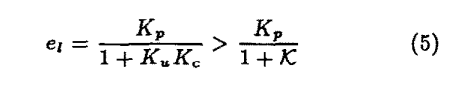

When a controller with integral action is used  the static error due to a step load disturbance is zero. 
A meaningful measure is then the maximum error due to a load disturbance. To obtain a dimension-free quantity it is also divided by the process gain. The following variable is thus obtained 

当使用具有积分作用的控制器时，由阶跃负载扰动引起的静态误差为零。因此，有意义的量是由于负载干扰引起的最大误差。除以过程增益便成为无量纲量, 从而有以下结果：

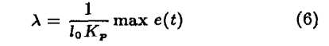

where $l_o$ is the amplitude of the step disturbance

其中 $l_o$是阶跃扰动的幅度。 

### 归一化闭环上升时间

The closed loop rise time is a measure of the response  speed of the closed Ioop system. Agab, to obtain a  dimension-free parameter it wih be normalized by  the apparent dead time f, of the open loop system.  The parameter is thus

上升时间是用来衡量闭环系统相应速度的量。可以通过归一化死区时间来获得：

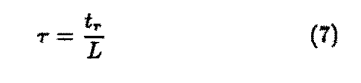

## 4.经验方法

The Ziegler-Nichols closed-loop tuning procedure  was applied to a large number of different processes.  It was attempted to correlate the observed properties  of the open and closed loop systems to the features  introduced in Section 3. In this section we will  present the empirical results. Processes with the  transfer functions will be investigated.  These models cover a wide range  of dynamic characteristics such as pure dead-time  and no~~~urn phase response, The main features  of the models are summarized in &&rZim et al (1988). 

Ziegler-Nichols 闭环争锋方法被应用于大量不同的过程。通过将观察到的开环和闭环系统的属性与第 3 节中介绍的特征相关联。在本节中，我们将介绍实证结果。 研究传递函数如下的过程。 

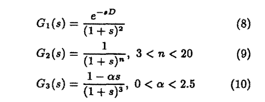

这些模型涵盖了广泛的动态特性，例如纯死区时间和非最小相位响应，Astr (1988) 总结了模型的主要特点 。 

the normalized apparent dead-time was measured from the step responses. The ultimate gain  was determined by simuIation. Parameters of PID  regulator were determined by a straight forward 
application of the Ziegler-Nichols closed-loop method without fine tuning, i.e. with values of proportional 
gain Kc, integral time Ti and derivative time Td set as O.S&, 0.5T,, and O.l%T, respectiveIy. The closed 
Ioop performance is judged based on the closed loop step and load responses. 

表征死区时间通过阶跃响应获得。极限增益通过仿真获得，PID调节器的参数通过尼格尔-齐格斯闭环整定方法获得，比例、积分、微分系数分别为：$0.6K_u,0.5T_u,0.125T_u$ 闭环响应性能基于闭环阶跃和负载响应判断。

 The results obtained are summarized in Tables  l-3. The tables give a parameter that characterizes  the process, the ultimate period T,, the overshoot OS,  the undershoot ’16s of the closed loop step response,  the apparent normalized dead-time B = L/T, the  normalied loop gain K, the normalized closed loop  rise time 7 = t,/L, and the normalized peak load  error ICX, 

结果在表格1-3中。表格中为过程特征参数：末端时间$T_u$ ，超调量$os$，表征归一化死区时间$ \theta = L/T$ 归一化回路增益$K$ 归一化闭环响应时间$\tau = t_r/L$ 归一化峰值负载误差 $K \lambda$。

The results for the first process are summarized in Table 1.The cIosed Ioop behavior was judged to  be satisfactory for 0.15 < B < 0.6. The overshoot  for e in the low range is too high. This is however  easiIy reduced by using the setpoiut weighting factor  mo~~cation, see Astriim and I&gglund (19~8~. For  large values of 8 there is a pronounced undershoot in  the step response. The resuhs for the second process  are summarized in Table 2. The closed loop behavior  was judged to be satisfactory for 0.22 < 6 < 9.64.  The overshoot for B in the low range ia too hiih.  This is however easiIy reduced by using the setpoint weighting factor modification. For large v&es of  8 there is a pronounced undershoot in the step  response, Similar resnfts are obtained for the third  process ss summarised iu Table 3.

第一个过程的结果总结在表 1 中。 闭环响应满足：$0.15<\theta <0.6$ ，此$\theta$ 范围内的超调量过大。这可以通过降低目标权重系数减缓。当$\theta $ 过大时，单位阶跃响应超调量大。第二个过程结果在表2中， 闭环响应满足：$0.22<\theta <0.64$ ，此$\theta$ 范围内的超调量过大。表3中的结果基本一致。

## 5.relations

前文引入了归一化死区时间$\theta $、过程增益${K}$，来表征开环开环系统特性。引入峰值过载误差和归一化闭环上升时间来表征闭环响应。现在将建立这些参数之间的一些关系。

### 归一化死区时间和过程增益

从表1-3中可以看出，归一化死区时间和过程增益存在一定的关系。可能通过一定的系统找出其具体的联系。对于带死区时间的一阶系统：

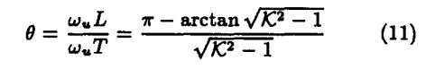

参数具体联系如图1，能够准确找出（8）、(9)、(10)过程中$K$和$\theta$ 之间的关系。也可以通过第四节中的实验获得。具体关系如图1所示。从图中可以看出，对于高阶运动学过程，$K\theta$ 近似为一个常量。这表明可以通过归一化过程增益$K$ 替代归一化死区时间$\theta$来评估系统特性。 

    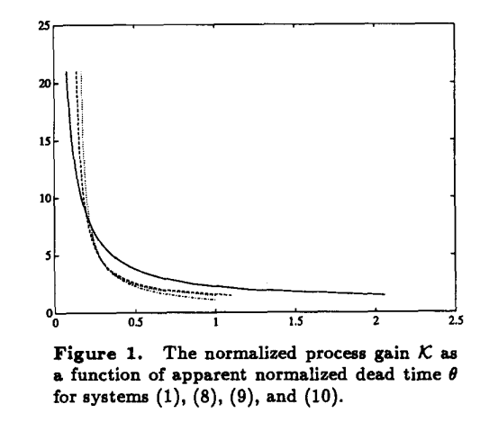
    
Figure 1

### 峰值过载误差和归一化死区时间

考虑使用以下方法获得的闭环系统过程和控制器。 假设干扰通过 PID 控制和 Ziegler-Nichols 调整进入受控对象输入。 从负载扰动到输出的传递函数为 

使用Zieger-Nichols整定的PID控制器传递函数为：

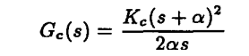

其中：

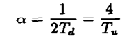

正如 Hang 所讨论的，这种选择可以很好地抑制负载干扰 。使用Zieger-Nichols整定的闭环系统带宽为$\omega  \approx 7.4/T_u$ ,式(12)中的传递函数可以近似表示为：

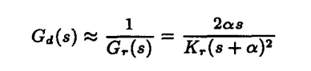

相应的单位阶跃响应为：

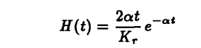

当 $t = 2T_d$ 的时候上述表达式值最大。

至此，可以看到，参数$K\lambda$ 为一个常量。同时，通过表1-3可以发现，$K\lambda \approx 1.3$。在智能控制器中$\lambda$ 可以用来检验使用Zieger-Nichols整定是否可以满足峰值过载误差的要求。通过分析可得，对于阶跃扰动，峰值过载误差出现在$T_u/4$ 时候。

### 闭环上升时间

表1-3的实验结果表明，归一化上升时间近似为常量。$\tau \approx 1$。同等式(7)比较，表明物理上$t_r \approx L$。这意味着，通过Zieger-Nichols方法获得的闭环系统上升时间约等于开环系统的表征死区时间。

## 6.Ziegler-Nichols整定

上述结果将用来评估使用Ziegler-Nichols整定的PID控制器。首先，Ziegler-Nichols整定过程较为简单。整定过程是基于一个简单的过程动力学特征，这个特征可以是从阶跃响应得到的$a$和$L$ ,或者是Nyquist曲线中的$K_u$ 和$\omega_u$中的任何一个。同时，我们已经得到两个表征闭环系统性能的等式：$\tau\approx1 . K\lambda \approx 1.3$ 。$\tau \approx 1$表明Zieger-Nichols整定尝试使得闭环系统响应时间和表征死区时间一致。

### 什么时候可以使用 Ziegler-Nichols 整定？ 

结果表明，在一些条件下使用Ziegler-Nichols 整定能获得很好的结果，这些条件可以用$\theta $ 或者 $K=K_uK_p$ 表征。

在表4中对结果进行了总结，表4中介绍了四种情况，他们可以按下分类：

情形一，$\theta < 0.15$ 或者 $K > 20$，Ziegler-Nichols 整定效果一般。因为在这种情况下，可能使用到较高的回路增益。有多种可以选中的控制器。如果对稳态误差的要求不太严格，则 P 或 PD 控制器可能满足要求。如果稳态误差要求在10%附近，那么可以使用比例控制器(基于控制器增益是极限增益的一半)。如果想要更小的稳态误差，则需要添加积分环节。在某些情况下，通过使用微分作用或更复杂的控制法则可以显着提高性能。 具有大时间常数控制的温度控制是典型的情况。 我们发现，通过Ziegler-Nichols整定方法，微分时间$T_d = T_i/4$ 在这种情形下过大。阶跃响应到达稳态的时间太长。更好的值是$T_d = T_i/8$ 。

情形二，$0.15 < \theta < 0.6$ 或者 $2< K < 20$：这是使用齐格勒-尼科尔斯调整的 PID 控制器的主要应用领域。 在这种情况下效果很好。 微分作用通常非常有用。 

情形三，$0.6 < \theta < 1$ 或者 $1.5 < K < 2$：当$\theta$ 接近1时候，Ziegler-Nichols 整定的能力将会变低。因为Ziegler-Nichols 整定过程试图使闭环上升时间等于表观死区时间。使用 Ziegler-Nichols 整定的 PID 控制器很难实现严格控制。可以考虑其他调整方法和其他控制器结构，例如 Smith 预估器、极点放置或前馈。 

情形四，$1 < \theta $ 或者 $ K < 1.5$：当$\theta > 1$ 的情况下，不推荐使用Ziegler-Nichols 整定。当$\theta >0.6$ 时，PID控制器性能差一方面是因为PID控制器的内在限制，另一方面是由于Ziegler-Nichols 整定过程导致。

CohenCoon提出了一种改进的Ziegler-Nichols 整定规则。通过选择其他的整定方法，PID控制器甚至可以在$\theta > 10$ 的情况下有很好的控制效果。Hang 和 AsrGm (1988) 的研究成果表明，不仅仅可以使用$\theta$来预测 Ziegler-Nichols 调整公式的有效性。 推荐以下方法取代手动精细调试。当 $\theta <0.6$ 时，Ziegler-Nichols 公式的主要缺点是过度超调。 这可以通过设定点加权因子来克服，其中加权因子是$\theta$的简单函数。 当 $\theta > 0.6$ 时，通过Ziegler-Nichols 整定计算得到的积分时间需要通过$\theta$ 的一个简单函数进行修正。在不进行手动精细调试的情况下，为了获得高质量的PID控制器，上述修改是很有必要的。

表4表明，可以根据归一化死区时间对使用Ziegler-Nichols 整定的PID控制器进行更广的分类。如果我们尝试构建带有决策辅助的控制系统，在该控制系统中还建议仪器工程师或操作员选择控制器时，这种观察结果是有用的。

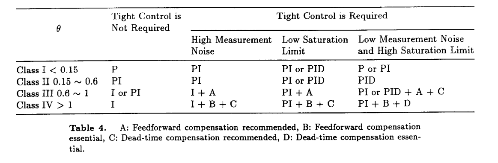

### 智能控制器种的应用

现在有一些的自动调整器是基于齐格勒-尼科尔斯整定过程的。他们的一个缺点是无法推理可达到的性能。 本文的结果表明有存在一种简单的修改。 通过参数$\theta$ 或者 $K$ 可以决定自动调整器使用P、PI或者PID形式的控制方法，同时也能表明更复杂的控制律的有效性。对于基于瞬态方法的自动调整器，不仅可以通过确定$a$ 和 $L$ $Kp$还能通过基于表 4 的逻辑来实现。 对于基于继电器的自动调整期，有必要通过$K_p$来补充$\omega_u$和$K_u$的确定。这可以很容易地通过测量稳态操作中输入和输出的平均值来实现。 也可以修改继电器调谐，从而确定稳态增益。 如上所述，使用 Hang 和 AsrGm (1988) 的相关公式可以显着提高调谐公式在宽范围 $\theta$值上的准确性。 

### 控制性能的在线评估

本文的结果也可用于评估闭环系统中反馈回路的性能。 例如，考虑归一化上升时间的关系式 (15)。 可以通过修改目标值测量上升时间。如果控制器经过适当调整，则闭环上升时间应等于表征死区时间。如果实际上升时间明显不同，例如大于 50%，则表明环路调试不佳。 当阻尼足够但不确定控制是否过于迟缓时，这种类型的评估特别有用。请注意，Foxboro 的 EXACT基于模式识别自适应控制器不能做出这种判断。类似地，可以通过在控制器输出处引入扰动来使用关系式 (13)。 如果最大误差偏离，由 (13) 预测，我们可以怀疑循环调整不佳。 

## 7.结论

在本文中，尝试分析使用齐格勒-尼科尔斯闭环方法调整的 PID 控制器的简单反馈回路。 结果表明，归一化过程增益 $K$，归一化死区时间$\theta$ ，归一化闭环上升时间$\tau$ 峰值过载误差$\lambda $对于评估可实现的性能和选择合适的控制器很有用。还提出了确定这些参数的简单方法。 

已经证明$K$ 和 $\theta$ 是相关的，它们可以用来评估控制问题。$\theta$较小的时候，表示可以使用 P 或 PI 控制进行严格控制，但有时也可以使用更复杂的控制律改进控制效果。 $0.15<\theta <0.6$ 通过使用齐格勒-尼科尔斯调整的 PID 控制器控制效果很好。当归一化死区时间  $0.6<\theta $，Ziegler-Nichols 整定的结果很差。 此外，还有一些关系，如 $K\lambda \approx 1.3$和 $\tau \approx 1$，可用于评估闭环响应时间和负载抑制特性。结果表明，确定与控制器调整相关的参数$K$或$\theta$中的至少一个是有用的，因为这些参数对于评估可实现的性能非常重要。

## 8.引用

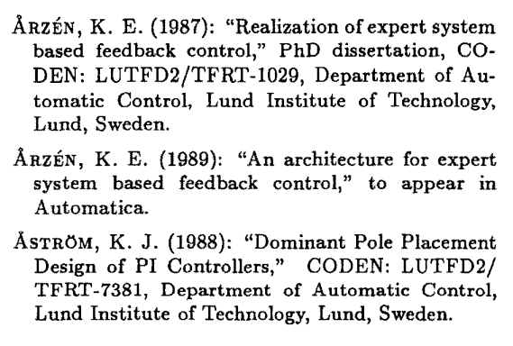

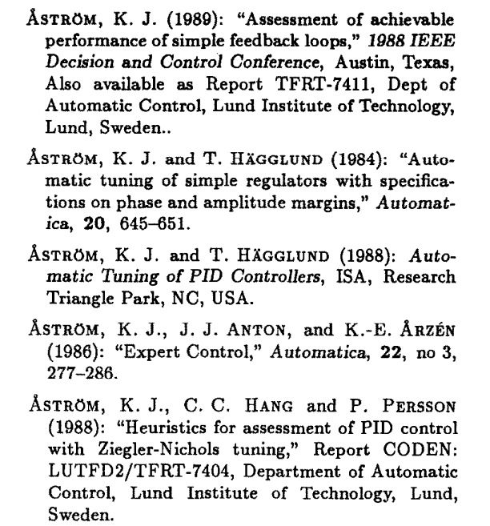

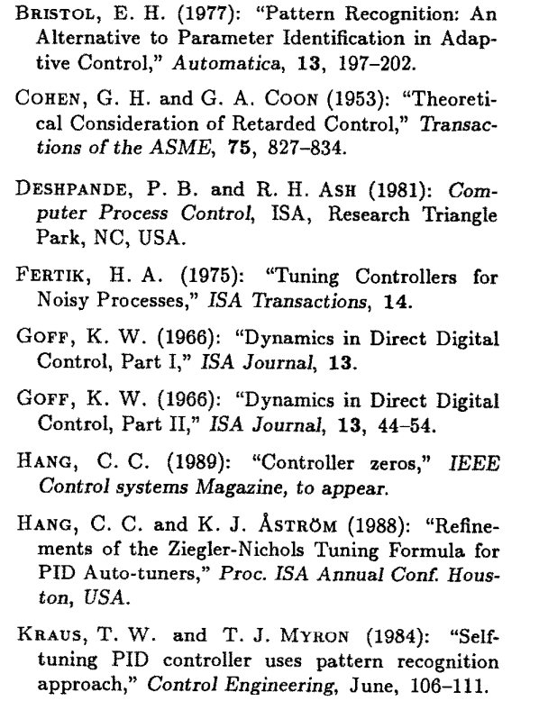

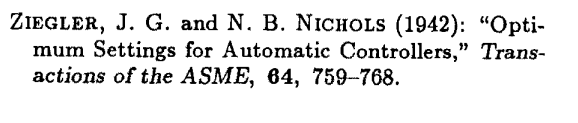
